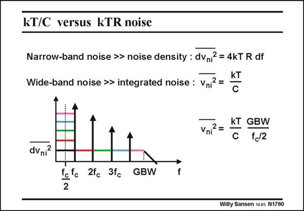

# SANSEN-1760 · kT/C versus kTR noise

章节：17 开关电容滤波器  
PDF 页：505；书本页：515；幻灯片编号：1760  
状态：unreviewed



## 对应教材讲解

### PDF 505 · 书本 515

Because the GBW is always larger than the clock frequency f , the noise is folded c back towards the lowest frequency band. Actually, this is a heavy case of aliasing. The total integrated noise of an opamp with load capacitance C (or compensation capacitance for a two-stage opamp) is close to kT/C (see Chapter 4). The integrated input noise voltage power has to be multiplied by the ratio of the GBW to the clock frequency as shown in this slide. For a GBW which is about 3 times f , this gives a multiplication c factor of 6 for the noise power or about 2.5 for the noise voltage. For less noise, larger capacitors must be used. Also, minimum values of GBW must be used.

## 公式／性能结论候选摘录

以下为规则截取的原文，尚未逐项判读。

（未由规则找到；不代表原页没有此类内容。）

## 曲线结论候选摘录

以下为规则截取的原文，尚未逐项判读。

（未由规则找到；不代表原页没有此类内容。）

## 原文条件与近似候选摘录

以下为规则截取的原文，尚未逐项判读。

（未由规则找到；不代表原页没有此类内容。）

## 幻灯片 OCR（未校正）

```text
kT/C versus kTR noise
Narrow-band noise >> noise density : dvni? = 4kT R df
Wide-band noise >> integrated noise : Vni2 =
kT
Vniz =
dvni2
KT GBW
C
f.2
2fc 3fc
GBW
f
Willy Sansen 1005 N1760
```

数学上下标、分数及正负号以原图为准。电路图已保留；未核对的连接不输出成可仿真 netlist。
