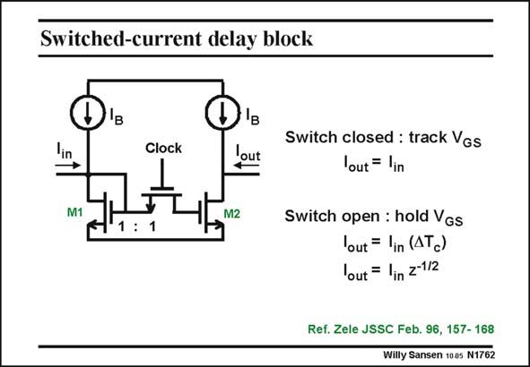

# SANSEN-1762 · Switched-current delay block

章节：17 开关电容滤波器  
PDF 页：506；书本页：516；幻灯片编号：1762  
状态：unreviewed



## 对应教材讲解

### PDF 506 · 书本 516

Indeed, when a switch is added to a current mirror as shown in this slide, the operation is exactly as in a current mirror when the switch is closed. For equal transistor sizes, the output current I equals the input curout rent I . in When the switch opens however, capacitance C GS2 holds the voltage at the Gate of M2. As a result, the output current I continout ues to flow, independent of what happens at the input. This stage has memory. It generates a delay of half a clock period. It can thus be used as a filter in a similar way as a switched-capacitor block acts as a memory and generates delay. Such a filter is shown next.

## 公式／性能结论候选摘录

以下为规则截取的原文，尚未逐项判读。

- PDF 506: For equal transistor sizes, the output current I equals the input curout rent I . in When the switch opens however, capacitance C GS2 holds the voltage at the Gate of M2.
- PDF 506: As a result, the output current I continout ues to flow, independent of what happens at the input.
- PDF 506: It can thus be used as a filter in a similar way as a switched-capacitor block acts as a memory and generates delay.

## 曲线结论候选摘录

以下为规则截取的原文，尚未逐项判读。

（未由规则找到；不代表原页没有此类内容。）

## 原文条件与近似候选摘录

以下为规则截取的原文，尚未逐项判读。

（未由规则找到；不代表原页没有此类内容。）

## 幻灯片 OCR（未校正）

```text
Switched-current delay block
in
M1
Clock
lout
M2
1:1
Switch closed : track Vgs
lout = lin
Switch open : hold Vgs
lout = lin (ATc)
lout = lin z-112
Ref. Zele JSSC Feb. 96, 157- 168
Willy Sansen 100s N1762
```

数学上下标、分数及正负号以原图为准。电路图已保留；未核对的连接不输出成可仿真 netlist。
