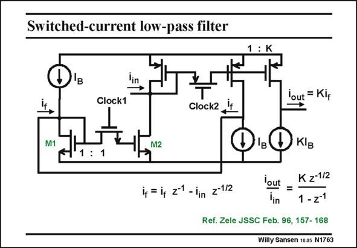

# SANSEN-1763 · Switched-current low-pass filter

章节：17 开关电容滤波器  
PDF 页：506；书本页：516；幻灯片编号：1763  
状态：unreviewed



## 对应教材讲解

### PDF 506 · 书本 516

Two switched-current mirrors with feedback yield a low-pass filter, as shown in this slide. The output current i out equals K times the feedback current i . f On clock phase 2, the feedback current i is the f sum of the input current, applied half a clock period earlier and the feedback current, applied a full clock period earlier. The current gain is more easily found. It has the same expression in z as a switched-capacitor low-pass filter. The gain is K and the delay is half a clock period. The difference with a switched-capacitor filter is that currents are used, rather than voltages. The advantage of this filter is that no capacitors are added. The transistor capacitances are used. This type of filter may be more compatible with a digital CMOS process. Another example is given next.

## 公式／性能结论候选摘录

以下为规则截取的原文，尚未逐项判读。

- PDF 506: The output current i out equals K times the feedback current i . f On clock phase 2, the feedback current i is the f sum of the input current, applied half a clock period earlier and the feedback current, applied a full clock period earlier.
- PDF 506: The current gain is more easily found.
- PDF 506: The gain is K and the delay is half a clock period.

## 曲线结论候选摘录

以下为规则截取的原文，尚未逐项判读。

- PDF 506: The output current i out equals K times the feedback current i . f On clock phase 2, the feedback current i is the f sum of the input current, applied half a clock period earlier and the feedback current, applied a full clock period earlier.

## 原文条件与近似候选摘录

以下为规则截取的原文，尚未逐项判读。

（未由规则找到；不代表原页没有此类内容。）

## 幻灯片 OCR（未校正）

```text
Switched-current low-pass filter
1: K
Clock1
lout = Kif
Clock2
M1
1: 1
M2
i4 = iq 2-1 - lin -1/2
KlB
lout =
K z-1/2
5
1 - 21
Ref. Zele JSSC Feb. 96, 157- 168
Willy Sansen 1005 N1763
```

数学上下标、分数及正负号以原图为准。电路图已保留；未核对的连接不输出成可仿真 netlist。
