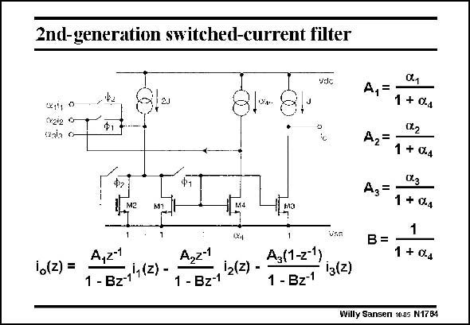

# SANSEN-1764 · 2nd-generation switched-current filter

章节：17 开关电容滤波器  
PDF 页：507；书本页：517；幻灯片编号：1764  
状态：unreviewed



## 对应教材讲解

### PDF 507 · 书本 517

In this filter more is done with less transistors. A number of second-order effects can be avoided. Judicious playing with transistor size ratios allows construction of fairly sophisticated filter characteristics. The actual derivation is left as an exercise for the reader.

## 公式／性能结论候选摘录

以下为规则截取的原文，尚未逐项判读。

（未由规则找到；不代表原页没有此类内容。）

## 曲线结论候选摘录

以下为规则截取的原文，尚未逐项判读。

- PDF 507: Judicious playing with transistor size ratios allows construction of fairly sophisticated filter characteristics.

## 原文条件与近似候选摘录

以下为规则截取的原文，尚未逐项判读。

（未由规则找到；不代表原页没有此类内容。）

## 幻灯片 OCR（未校正）

```text
2nd-generation switched-current filter
vdc
4x111 0
012i2 9
(xaia o
Ф1
Аз:
ME
M1
M4
io(z) =
vsn
A,2-
A,21
A3(1-z-1)
1 - Bz-14(2) -
i2(z) -
iз(z)
1 - Bz-1
1 -Bz1
B =
1 + 0d
Cx.2
1 + 0л
X.3
1 + 0д
1
1 + 0-д
Willy Sansen 1005 N1784
```

数学上下标、分数及正负号以原图为准。电路图已保留；未核对的连接不输出成可仿真 netlist。
