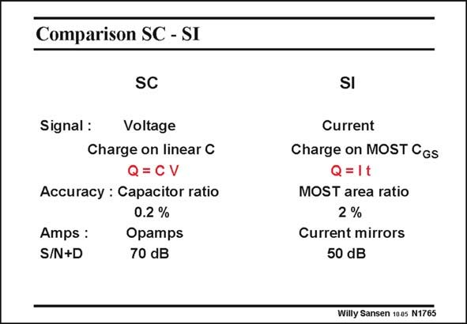

# SANSEN-1765 · Comparison SC - SI

章节：17 开关电容滤波器  
PDF 页：507；书本页：517；幻灯片编号：1765  
状态：unreviewed



## 对应教材讲解

### PDF 507 · 书本 517

A comparison between switched-capacitor and switched-current filters is now imperative. In a switched-capacitor filter a charge is stored on a capacitor. The signal is therefore a voltage. The accuracy depends on the full charge transfer from one capacitor to another. This also depends on the matching of these two capacitors. Mismatch, clock injection and charge distribution limit the dynamic range to about 70 dB without excessive precautions. In a switched-current filter a charge is a result of a current flowing during a certain amount of time, determined by the clock period. The signal is a current. The accuracy depends on the matching of transistor sizes. Mismatch, clock injection and charge distribution limit the dynamic range to about 50 dB without excessive precautions. The main difference is that in a switched-current filter the charge transfer is less accurate because of the worse mismatch between transistors than between capacitors. The main advantage of switched-current filters is that they reach higher frequencies because they do not use opamps, just current-mirrors. It is clear that such a comparison can only be of first-order. A full comparison would take a full workshop.

### PDF 508 · 书本 518

Another comparison between all important filter types will be given at the end of Chapter 19.

## 公式／性能结论候选摘录

以下为规则截取的原文，尚未逐项判读。

- PDF 507: The signal is therefore a voltage.
- PDF 507: The accuracy depends on the full charge transfer from one capacitor to another.
- PDF 507: This also depends on the matching of these two capacitors.
- PDF 507: Mismatch, clock injection and charge distribution limit the dynamic range to about 70 dB without excessive precautions.
- PDF 507: The accuracy depends on the matching of transistor sizes.
- PDF 507: Mismatch, clock injection and charge distribution limit the dynamic range to about 50 dB without excessive precautions.

## 曲线结论候选摘录

以下为规则截取的原文，尚未逐项判读。

（未由规则找到；不代表原页没有此类内容。）

## 原文条件与近似候选摘录

以下为规则截取的原文，尚未逐项判读。

（未由规则找到；不代表原页没有此类内容。）

## 幻灯片 OCR（未校正）

```text
Comparison SC - SI
SC
Signal:
Voltage
Charge on linear C
Q=CV
Accuracy : Capacitor ratio
0.2 %
Amps :
S/N+D
Opamps
70 dB
SI
Current
Charge on MOST CGs
Q=1t
MOST area ratio
2 %
Current mirrors
50 dB
Willy Sansen 1005 N1765
```

数学上下标、分数及正负号以原图为准。电路图已保留；未核对的连接不输出成可仿真 netlist。
