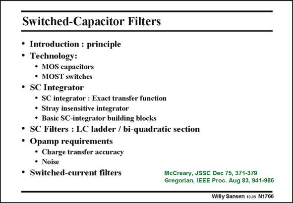

# SANSEN-1766 · Switched-Capacitor Filters

章节：17 开关电容滤波器  
PDF 页：508；书本页：518；幻灯片编号：1766  
状态：unreviewed



## 对应教材讲解

### PDF 508 · 书本 518

In this Chapter switchedcapacitor techniques have been introduced. Considerable attention is paid to the capacitors, switches and opamps required to build such filters. Also the limitations are discussed such as mismatch, clock injection, charge redistribution and noise. Finally a short comparison with switched-current filters is given. Several more types of filters are available on silicon. Continuous-time filters are next.

## 公式／性能结论候选摘录

以下为规则截取的原文，尚未逐项判读。

- PDF 508: Also the limitations are discussed such as mismatch, clock injection, charge redistribution and noise.

## 曲线结论候选摘录

以下为规则截取的原文，尚未逐项判读。

（未由规则找到；不代表原页没有此类内容。）

## 原文条件与近似候选摘录

以下为规则截取的原文，尚未逐项判读。

（未由规则找到；不代表原页没有此类内容。）

## 幻灯片 OCR（未校正）

```text
Switched-Capacitor Filters
• Introduction : principle
• Technology:
• MOS capacitors
• MOST switches
• SC Integrator
• SC integrator : Exact transfer function
• Stray insensitive integrator
• Basic SC-integrator building blocks
• SC Filters : LC ladder / bi-quadratic section
• Opamp requirements
• Charge transfer accuracy
• Noise
• Switched-current filters
McCreary, JSSC Dec 75, 371-379
Gregorian, IEEE Proc. Aug 83, 941-986
Willy Sansen 1005 N1766
```

数学上下标、分数及正负号以原图为准。电路图已保留；未核对的连接不输出成可仿真 netlist。
