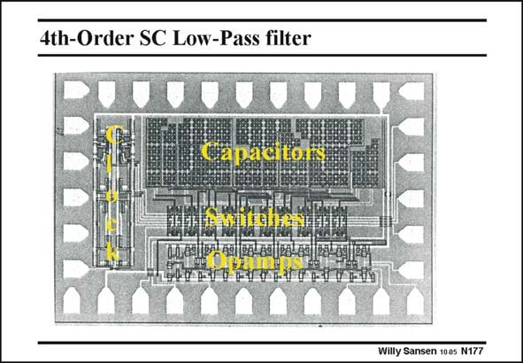

# SANSEN-177 · 4th-Order SC Low-Pass filter

章节：17 开关电容滤波器  
PDF 页：478；书本页：488；幻灯片编号：177  
状态：unreviewed



## 对应教材讲解

### PDF 478 · 书本 488

Moreover, the layout of such a switched-capacitor filter can be made quite regular. All opamps are on one side, the capacitors are on the other side and the switches in the middle. Quite often, all opamps are made equal, which may not be the best solution for minimum power consumption, but which saves design time. The capacitors are always made up of capacitor banks, using an integer number of equal unit capacitors. These have to be laid out for optimum matching. Let us have a closer look now at these capacitors and switches.

## 公式／性能结论候选摘录

以下为规则截取的原文，尚未逐项判读。

- PDF 478: Quite often, all opamps are made equal, which may not be the best solution for minimum power consumption, but which saves design time.
- PDF 478: The capacitors are always made up of capacitor banks, using an integer number of equal unit capacitors.

## 曲线结论候选摘录

以下为规则截取的原文，尚未逐项判读。

（未由规则找到；不代表原页没有此类内容。）

## 原文条件与近似候选摘录

以下为规则截取的原文，尚未逐项判读。

（未由规则找到；不代表原页没有此类内容。）

## 幻灯片 OCR（未校正）

```text
4th-Order SC Low-Pass filter
ПДЕЕ
Capacitors
mewntcheaa
FAP у019
Willy Sansen 1005 N177
```

数学上下标、分数及正负号以原图为准。电路图已保留；未核对的连接不输出成可仿真 netlist。
