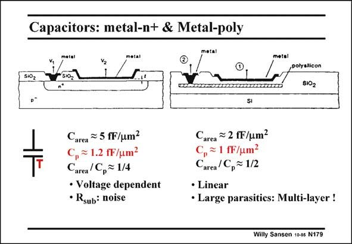

# SANSEN-179 · Capacitors: metal-n+ & Metal-poly

章节：17 开关电容滤波器  
PDF 页：479；书本页：489；幻灯片编号：179  
状态：unreviewed



## 对应教材讲解

### PDF 479 · 书本 489

A MOS capacitor is formed between the top metal plate (or gate poly) and the source/drain diffusion. The thin gate oxide serves as a dielectricum. Values are given in this slide for a 0.35 micron CMOS technology. Its gate oxide thickness is about 1/50 or 7 nm. This gives a C of ox 5×10−7 F/cm2 or 5 fF/mm2 (see Chapter 1). The n+ plate has a lot of resistance however, which gives a lot of noise and even some voltage dependence. It is much better to substitute the bottom layer by a highly doped poly layer. This capacitor is more linear. Nowadays, many metal layers are available on top of the silicon structure. Any pair can be selected to be used as capacitors. Two criteria have to be fulfilled, however. The dielectricum must be of high quality and its thickness must be reproducible. This is why the technology file usually suggest which pair of metal layers are best used for capacitors and what is the capacitor per unit square. For each integrated capacitor, the bottom plate has a parasitic capacitance C to the underlying p layer. For the capacitor on the left, this is the junction capacitance to the substrate. For the one on the right, this parasitic capacitance is between the poly layer and the substrate. This parasitic capacitance is relatively large. It must be taken into account in the design of such a filter.

## 公式／性能结论候选摘录

以下为规则截取的原文，尚未逐项判读。

- PDF 479: The n+ plate has a lot of resistance however, which gives a lot of noise and even some voltage dependence.

## 曲线结论候选摘录

以下为规则截取的原文，尚未逐项判读。

（未由规则找到；不代表原页没有此类内容。）

## 原文条件与近似候选摘录

以下为规则截取的原文，尚未逐项判读。

（未由规则找到；不代表原页没有此类内容。）

## 幻灯片 OCR（未校正）

```text
Capacitors: metal-n+ & Metal-poly
S102
,polyalicon
8102
Carea = 5 fF/um?
p = 1.2 fF/um?
Carea /Cp= 1/4
• Voltage dependent
• Rsub: noise
Carea
≥ 2 fF/um?
, = 1 fF/um?
Carea /C,~ 1/2
• Linear
• Large parasitics: Multi-layer !
Willy Sansen 10-gs N179
```

数学上下标、分数及正负号以原图为准。电路图已保留；未核对的连接不输出成可仿真 netlist。
