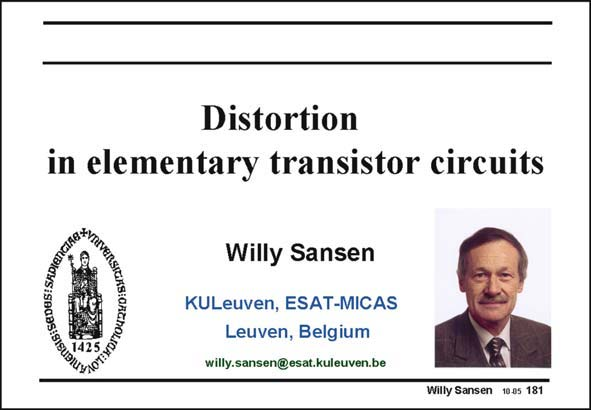

# SANSEN-181 · Slide 181

章节：18 基本晶体管电路的失真  
PDF 页：509；书本页：519；幻灯片编号：181  
状态：unreviewed



## 对应教材讲解

### PDF 509 · 书本 519

Distortion has become an important topic. The larger the signal levels, the larger the distortion becomes. Indeed, the supply voltage decreases with smaller channel lengths. The signal levels have to be made as large as possible to obtain a Signalto-Noise-and-Distortion ratio, which is as high as possible. We now need to know which distortion levels correspond with which signal levels. Unfortunately, distortion is a kind of garbage can for everything that impairs the spectral purity of a signal. Every month new kinds of distortion are discovered. We will concentrate, however, on the main sources. The distortion levels will be described in terms of signal amplitudes.

## 公式／性能结论候选摘录

以下为规则截取的原文，尚未逐项判读。

- PDF 509: Indeed, the supply voltage decreases with smaller channel lengths.

## 曲线结论候选摘录

以下为规则截取的原文，尚未逐项判读。

（未由规则找到；不代表原页没有此类内容。）

## 原文条件与近似候选摘录

以下为规则截取的原文，尚未逐项判读。

（未由规则找到；不代表原页没有此类内容。）

## 幻灯片 OCR（未校正）

```text
Distortion
in elementary transistor circuits
BIS:SEDUS:SAD10
Willy Sansen
KULeuven, ESAT-MICAS
Leuven, Belgium
willy.sansen@esat.kuleuven.be
Willy Sansen 10.05 181
```

数学上下标、分数及正负号以原图为准。电路图已保留；未核对的连接不输出成可仿真 netlist。
