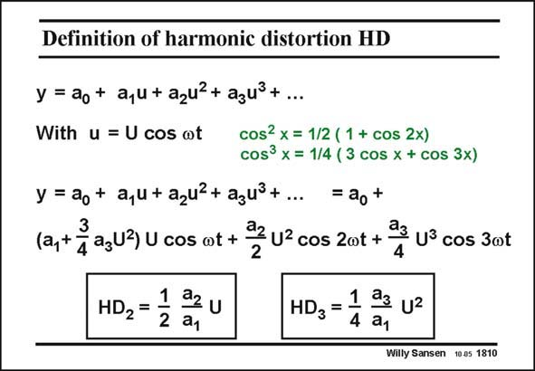

# SANSEN-1810 · Definition of harmonic distortion HD

章节：18 基本晶体管电路的失真  
PDF 页：513；书本页：523；幻灯片编号：1810  
状态：unreviewed



## 对应教材讲解

### PDF 513 · 书本 523

Once the nonlinearity has been described by a power series, the harmonic distortion can easily be calculated. In an input signal, u is applied with amplitude U and frequency v, then a little trigonometry helps us to find the contributions at 2vand 3v. The ratio of the component at 2vto the fundamental at v is then by definition the second harmonic distortion. Since coefficient a is 3 usually quite small compared to a , the component at the fundamental at v is just about a U. 1 1 Note that the second harmonic distortion HD is proportional to the amplitude U of the 2 fundamental. Doubling the input voltage will therefore double the second harmonic distortion. In the same way, the third harmonic distortion is defined. The ratio of the component at 3vto the fundamental at v is thus by definition the third harmonic distortion. Note that the third harmonic distortion HD is proportional to the square 3 of the amplitude U of the fundamental. Doubling the input voltage will multiply the third harmonic distortion by four.

## 公式／性能结论候选摘录

以下为规则截取的原文，尚未逐项判读。

- PDF 513: Since coefficient a is 3 usually quite small compared to a , the component at the fundamental at v is just about a U. 1 1 Note that the second harmonic distortion HD is proportional to the amplitude U of the 2 fundamental.
- PDF 513: Doubling the input voltage will therefore double the second harmonic distortion.
- PDF 513: The ratio of the component at 3vto the fundamental at v is thus by definition the third harmonic distortion.
- PDF 513: Note that the third harmonic distortion HD is proportional to the square 3 of the amplitude U of the fundamental.

## 曲线结论候选摘录

以下为规则截取的原文，尚未逐项判读。

（未由规则找到；不代表原页没有此类内容。）

## 原文条件与近似候选摘录

以下为规则截取的原文，尚未逐项判读。

（未由规则找到；不代表原页没有此类内容。）

## 幻灯片 OCR（未校正）

```text
Definition of harmonic distortion HD
y = ao+ a,u + azu?+ azu3+...
With u = U cos ot
cos2 x = 1/2 ( 1 + cos 2x)
cos3 x = 1/4 ( 3 cos x + COs 3x)
y = ao+ a,u + azu?+ azu?+...
= ao+
(a,t agu3)u cos ot + 22 u2cos 20t + a u° cos 300
HD2=
1 a2 u
2 a1
HD3 =
1 a3 U2
4
• a1
Willy Sansen 10.05 1810
```

数学上下标、分数及正负号以原图为准。电路图已保留；未核对的连接不输出成可仿真 netlist。
