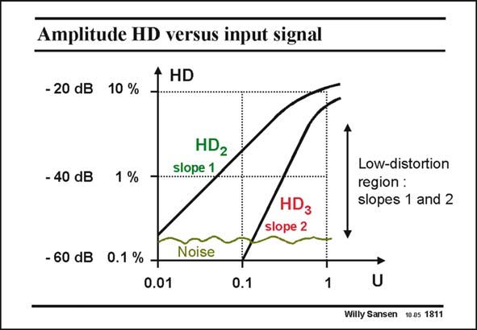

# SANSEN-1811 · Amplitude HD versus input signal

章节：18 基本晶体管电路的失真  
PDF 页：514；书本页：524；幻灯片编号：1811  
状态：unreviewed



## 对应教材讲解

### PDF 514 · 书本 524

These relationships are easily plotted on log scales as shown in this slide. They give straight lines with slopes of 1 dB/dB for HD 2 and 2 dB/dB for HD . 3 Clearly, this is only valid for low levels of distortion. For high input signals the curves flatten because of the high levels of distortion. We never want to increase the input voltage that much! For low input signals the distortion is drowned in noise. Clearly, it is impossible to recognize the slopes in that region. It is clear from the above, that the only way to measure distortion is to find the region where it has a linear dependence (on a log-log scale) on the input signal amplitude and to check whether the slopes are right. The second-order distortion must have a slope of 1 dB/dB and the thirdorder one 2 dB/dB.

## 公式／性能结论候选摘录

以下为规则截取的原文，尚未逐项判读。

- PDF 514: We never want to increase the input voltage that much!
- PDF 514: It is clear from the above, that the only way to measure distortion is to find the region where it has a linear dependence (on a log-log scale) on the input signal amplitude and to check whether the slopes are right.

## 曲线结论候选摘录

以下为规则截取的原文，尚未逐项判读。

- PDF 514: These relationships are easily plotted on log scales as shown in this slide.
- PDF 514: For high input signals the curves flatten because of the high levels of distortion.
- PDF 514: The second-order distortion must have a slope of 1 dB/dB and the thirdorder one 2 dB/dB.

## 原文条件与近似候选摘录

以下为规则截取的原文，尚未逐项判读。

（未由规则找到；不代表原页没有此类内容。）

## 幻灯片 OCR（未校正）

```text
Amplitude HD versus input signal
+ HD
- 20 dB 10 %
- 40 dB
1 %
HD2
Slope 1
Low-distortion
region :
slopes 1 and 2
HD3
slope 2
- 60 dB
0.1 % +
0.01
Noise
0.1
U
Willy Sansen 10.05 1811
```

数学上下标、分数及正负号以原图为准。电路图已保留；未核对的连接不输出成可仿真 netlist。
