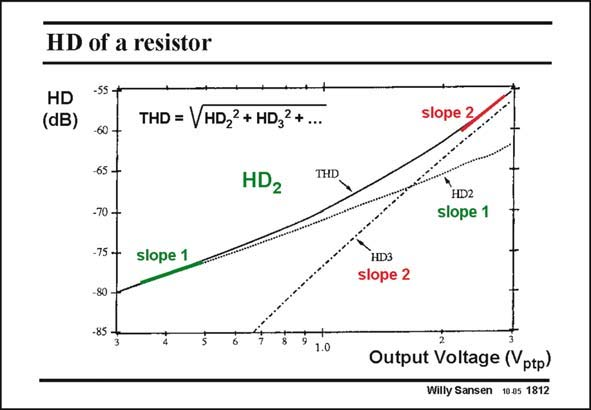

# SANSEN-1812 · HD of a resistor

章节：18 基本晶体管电路的失真  
PDF 页：514；书本页：524；幻灯片编号：1812  
状态：unreviewed



## 对应教材讲解

### PDF 514 · 书本 524

Some measurement equipment only measures total harmonic distortion THD, which is a kind of RMS value (or effective value) of all distortion ratios. In this way it is impossible of course to verify the slopes. However, quite often it is possible to identify the slopes in different regions of the input voltage. For example the THD was measured of a diffused resistor. For the low voltage across it, the HD is domi- 2 nant, whereas for high voltage, the HD is dominant. Indeed, they are clearly identified by 3 their slopes.

## 公式／性能结论候选摘录

以下为规则截取的原文，尚未逐项判读。

（未由规则找到；不代表原页没有此类内容。）

## 曲线结论候选摘录

以下为规则截取的原文，尚未逐项判读。

（未由规则找到；不代表原页没有此类内容。）

## 原文条件与近似候选摘录

以下为规则截取的原文，尚未逐项判读。

（未由规则找到；不代表原页没有此类内容。）

## 幻灯片 OCR（未校正）

```text
HD of a resistor
HD
(dB)
THD = VHD22 + HD32+...
-60
65 -
-70 -
-75 -
-80
-85
HD2
THD
slope 1
1.0
slope 2
HD2
slope 1
HD3
slope 2
Output Voltage (Vptp)
Willy Sansen 10.05 1812
```

数学上下标、分数及正负号以原图为准。电路图已保留；未核对的连接不输出成可仿真 netlist。
