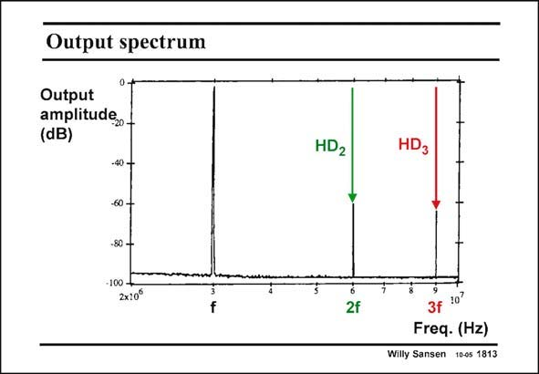

# SANSEN-1813 · Output spectrum

章节：18 基本晶体管电路的失真  
PDF 页：515；书本页：525；幻灯片编号：1813  
状态：unreviewed



## 对应教材讲解

### PDF 515 · 书本 525

The distortion is also measured by means of a spectrum analyzer. An example is shown in this slide for a fundamental frequency of 30 MHz. The second harmonic is set at 60 MHz and the third one at 90 MHz. Note however, that the components are now given, not the ratios of HD and 2 HD . Increasing the funda- 3 mental component by 1 dB will raise the second-order by 2 dB and the third-order by 3 dB.

## 公式／性能结论候选摘录

以下为规则截取的原文，尚未逐项判读。

（未由规则找到；不代表原页没有此类内容。）

## 曲线结论候选摘录

以下为规则截取的原文，尚未逐项判读。

（未由规则找到；不代表原页没有此类内容。）

## 原文条件与近似候选摘录

以下为规则截取的原文，尚未逐项判读。

（未由规则找到；不代表原页没有此类内容。）

## 幻灯片 OCR（未校正）

```text
Output spectrum
Output
amplitude,.
(dB)
-40 -
-60 -
-80 -
-100 -
2x10°
f
HD2
HD3
2f
10
Freq. (Hz)
Willy Sansen
10-0s 1813
```

数学上下标、分数及正负号以原图为准。电路图已保留；未核对的连接不输出成可仿真 netlist。
