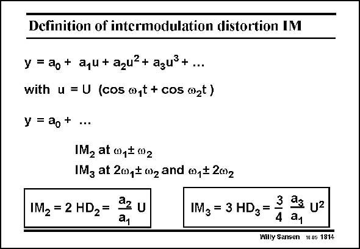

# SANSEN-1814 · Definition of intermodulation distortion IM

章节：18 基本晶体管电路的失真  
PDF 页：515；书本页：525；幻灯片编号：1814  
状态：unreviewed



## 对应教材讲解

### PDF 515 · 书本 525

Another way to characterize distortion is to use intermodulation distortion. For this purpose, two sine waves have to be applied. In this case, they have equal amplitudes U and frequencies v and v . This is more 1 2 common in communication systems where two adjacent channel frequencies are taken. In HiFi systems on the other hand, frequencies are taken of 50 Hz and 4 kHz with widely different amplitudes. These two fundamental frequencies will generate all intermodulation products, if applied to a nonlinear system, described by a power series. Substitution of input signal u generates second-order intermodulation products with coefficient a and third-order intermodulation products with coefficient a . 2 3 IM is now the ratio of the two components at v ±v to the fundamental. In a similar way 2 1 2 IM is now the ratio of the four components at 2v ±v and v ±v to the fundamental. 3 1 2 1 2 In order to learn where all these components occur on the frequency axis, a picture is given next. Note, however, that there is a very simple relationship between IM and HD. For example, IM is about 10 dB higher than HD . 3 3

## 公式／性能结论候选摘录

以下为规则截取的原文，尚未逐项判读。

- PDF 515: In this case, they have equal amplitudes U and frequencies v and v .

## 曲线结论候选摘录

以下为规则截取的原文，尚未逐项判读。

- PDF 515: In a similar way 2 1 2 IM is now the ratio of the four components at 2v ±v and v ±v to the fundamental. 3 1 2 1 2 In order to learn where all these components occur on the frequency axis, a picture is given next.

## 原文条件与近似候选摘录

以下为规则截取的原文，尚未逐项判读。

（未由规则找到；不代表原页没有此类内容。）

## 幻灯片 OCR（未校正）

```text
Definition of intermodulation distortion IM
y = ao + aqu+ azu?+ agu +....
with u = U (cos a,t + cos azt)
y = ao+ ...
IM, at 001$ 002
IMz at 20p$mzand @p$202
IM2 = 2 HD2=
az u
a1
3
IM3 = 3 HD3 =
aa Uz
4
ay
Willy Sansen 10 05 1814
```

数学上下标、分数及正负号以原图为准。电路图已保留；未核对的连接不输出成可仿真 netlist。
