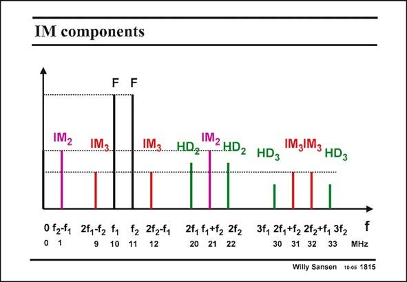

# SANSEN-1815 · IM components

章节：18 基本晶体管电路的失真  
PDF 页：516；书本页：526；幻灯片编号：1815  
状态：unreviewed



## 对应教材讲解

### PDF 516 · 书本 526

In order to show where all these intermodulation components appear, a simple example is given in which the fundamental frequencies are at 10 and 11 MHz. Both have their second harmonics at 20 and 22 MHz and their third harmonics at 30 and 33 MHz. They are all green. The second-order intermodulation components are at 1 and 21 MHz. It is clear that second-order distortion generates intermodulation components at low frequencies. This is important for HiFi amplifiers for example! Third-order intermodulation shows up in four places, i.e. at 9, 12, 31 and 32 MHz. The ones at 9 and 12 MHz are especially important, as they appear in the adjacent channels. They are also easier to measure with a spectrum analyzer as they appear in the same narrow frequency region as the fundamentals.

## 公式／性能结论候选摘录

以下为规则截取的原文，尚未逐项判读。

（未由规则找到；不代表原页没有此类内容。）

## 曲线结论候选摘录

以下为规则截取的原文，尚未逐项判读。

（未由规则找到；不代表原页没有此类内容。）

## 原文条件与近似候选摘录

以下为规则截取的原文，尚未逐项判读。

（未由规则找到；不代表原页没有此类内容。）

## 幻灯片 OCR（未校正）

```text
IM components
F
F
IM2
IM3..
IM3
HD2
2HD2 HD3
Mgl3 HDg
0 271 2ty72 to t3 2t3t, 21, 27, 272 37, 7, 17 22 , 31г
f
20 21 22
30 31 32 33 MHz
Willy Sansen 100s 1815
```

数学上下标、分数及正负号以原图为准。电路图已保留；未核对的连接不输出成可仿真 netlist。
