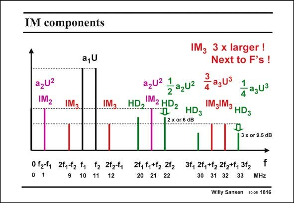

# SANSEN-1816 · IM components

章节：18 基本晶体管电路的失真  
PDF 页：516；书本页：526；幻灯片编号：1816  
状态：unreviewed



## 对应教材讲解

### PDF 516 · 书本 526

There are thus several reasons why we will focus on IM . 3 First of all, IM is 10 dB 3 larger than HD . It gives 3 components next to the fundamentals which are to measure, and finally, they are the only important ones in differential systems, in which second-order distortion is cancelled out, as we will see later.

## 公式／性能结论候选摘录

以下为规则截取的原文，尚未逐项判读。

- PDF 516: There are thus several reasons why we will focus on IM . 3 First of all, IM is 10 dB 3 larger than HD .

## 曲线结论候选摘录

以下为规则截取的原文，尚未逐项判读。

（未由规则找到；不代表原页没有此类内容。）

## 原文条件与近似候选摘录

以下为规则截取的原文，尚未逐项判读。

（未由规则找到；不代表原页没有此类内容。）

## 幻灯片 OCR（未校正）

```text
IM components
a,U
azU2
IM2
IM3.
IM3
IM3
3 x larger !
Next to F's !
azU 1azu2
Zagu3
1 agu3
HD M2HD2 HD3
IMJIM3 HDg
2x or 5d3
3 x or 9.5 dB
0 271 2ty72 to t3 2t3t, 21, 27, 272 37, 7, 17 22 , 31г
f
20 21 22
30 31 32 33
MHZ
Willy Sansen 100s 1816
```

数学上下标、分数及正负号以原图为准。电路图已保留；未核对的连接不输出成可仿真 netlist。
