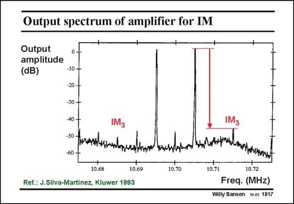

# SANSEN-1817 · Output spectrum of amplifier for IM

章节：18 基本晶体管电路的失真  
PDF 页：517；书本页：527；幻灯片编号：1817  
状态：unreviewed



## 对应教材讲解

### PDF 516 · 书本 526

An example of such a spectrum is shown in this slide. Two frequencies are applied to this IF filter, of 10.695 and 10.705 MHz. The IM components 3

### PDF 517 · 书本 527

can therefore be found at equal distances on both sides, i.e. at 10.685 and 10.715 MHz. The other distortion components have nothing to do with this. They are generated by some other mechanisms. Also, note that both IM 3 components are supposed to be equal. However, small differences are always possible!

## 公式／性能结论候选摘录

以下为规则截取的原文，尚未逐项判读。

- PDF 517: can therefore be found at equal distances on both sides, i.e. at 10.685 and 10.715 MHz.
- PDF 517: Also, note that both IM 3 components are supposed to be equal.

## 曲线结论候选摘录

以下为规则截取的原文，尚未逐项判读。

（未由规则找到；不代表原页没有此类内容。）

## 原文条件与近似候选摘录

以下为规则截取的原文，尚未逐项判读。

（未由规则找到；不代表原页没有此类内容。）

## 幻灯片 OCR（未校正）

```text
Output spectrum of amplifier for IM
Output
amplitude
(dB)
-10 -
-20-
-30 -
-40-
-50 -
60-
10.68
Ref.: J.Silva-Martinez, Kluwer 1993
10.69
10.70
IM3
улвннки.
LmeTAerA
10.71
10.72
Freq. (MHz)
Willy Sansen 10.05 1817
```

数学上下标、分数及正负号以原图为准。电路图已保留；未核对的连接不输出成可仿真 netlist。
