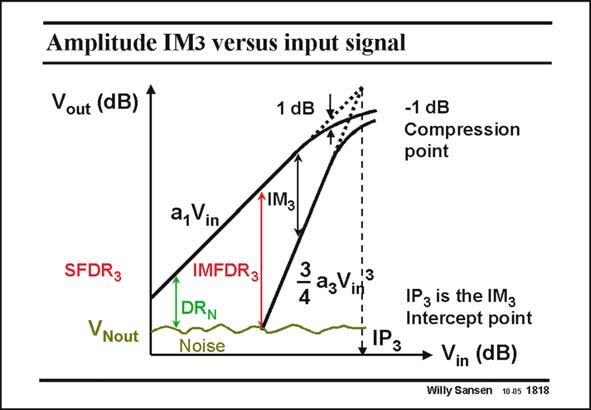

# SANSEN-1818 · Amplitude IM3 versus input signal

章节：18 基本晶体管电路的失真  
PDF 页：517；书本页：527；幻灯片编号：1818  
状态：unreviewed



## 对应教材讲解

### PDF 517 · 书本 527

Several more measures exist for IM . A few of them are 3 shown in this slide. A differential amplifier is taken with input voltage V , which gives a nonlinear in output voltage V , out described by a power series with coefficients a and a . 1 3 Because of the differential nature a =0. 2 The components themselves are plotted on a log scale versus (log) input voltage amplitude. The fundamental itself has a slope of 1 dB/dB, whereas the thirdorder IM components have a slope of 3 dB/dB. The ratio between both is the IM . Its maximum 3 3 value is attained when the IM3 level equals the noise level. This is the largest possible dynamic range that can be reached. It is the third-order Intermodulation Free Dynamic Range IMFDR . 3 It obviously occurs at only one specific value of the input voltage. Any other Noise Dynamic Range is smaller than the IMFDR . 3 The input voltage, for which their extrapolated values meet is called the IM intercept point 3 IP . The input voltage, for which the output is compressed by 1 dB is called the −1 dB 3 compression point. Obviously, both of them must be related to the expression of the IM , as 3 shown next.

## 公式／性能结论候选摘录

以下为规则截取的原文，尚未逐项判读。

- PDF 517: Its maximum 3 3 value is attained when the IM3 level equals the noise level.

## 曲线结论候选摘录

以下为规则截取的原文，尚未逐项判读。

- PDF 517: A differential amplifier is taken with input voltage V , which gives a nonlinear in output voltage V , out described by a power series with coefficients a and a . 1 3 Because of the differential nature a =0. 2 The components themselves are plotted on a log scale versus (log) input voltage amplitude.
- PDF 517: The fundamental itself has a slope of 1 dB/dB, whereas the thirdorder IM components have a slope of 3 dB/dB.

## 原文条件与近似候选摘录

以下为规则截取的原文，尚未逐项判读。

（未由规则找到；不代表原页没有此类内容。）

## 幻灯片 OCR（未校正）

```text
Amplitude IM3 versus input signal
Vout (dB) 1
1 dB
-1 dB
Compression
point
SFDR3
VNout
a, Vin
IMFDR3
DRN
Noise
1IM3
3
zazVirf
13
4
IP3 is the IM3
Intercept point
#IP3
• Vin (dB)
Willy Sansen 10.05 1818
```

数学上下标、分数及正负号以原图为准。电路图已保留；未核对的连接不输出成可仿真 netlist。
