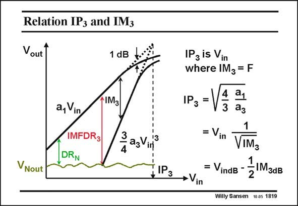

# SANSEN-1819 · Relation IP3 and IM3

章节：18 基本晶体管电路的失真  
PDF 页：518；书本页：528；幻灯片编号：1819  
状态：unreviewed



## 对应教材讲解

### PDF 518 · 书本 528

The IP is reached at the 3 input voltage for which the amplitude of the fundamental a V equals IM . Its 1 in 3 value is easily calculated from the power series. It is obviously determined by the same coefficients a and a 3 1 as IM itself. 3 The relation with IM is 3 now easily found, both in absolute value, as in dB. For example, for coefficients of a =0.01 and a = 3 1 0.5, IM =3.4×10−4 or 3 −69.4 dB for 0.15 V RMS input voltage (−16.5 dB); then IP =8.16 V or 18.2 dB. Note that, 1 V is taken as a reference 3 and hence all dB are actually dBV. In high-frequency systems such as communication systems, 1 V is usually not seen as a reference. It is the Voltage corresponding to 1 mW in 50 V. This gives as a reference Voltage, the square root of 0.05 V2 or 0.2236 V . In this case 13 dB (which RMS is 20×log(0.2236)) has to be added to the dBV values in this slide, which gives an input voltage of −3.5 dBm, an IM of −56.4 dBm and an IP of 31.2 dBm. 3 3

## 公式／性能结论候选摘录

以下为规则截取的原文，尚未逐项判读。

- PDF 518: The IP is reached at the 3 input voltage for which the amplitude of the fundamental a V equals IM .

## 曲线结论候选摘录

以下为规则截取的原文，尚未逐项判读。

（未由规则找到；不代表原页没有此类内容。）

## 原文条件与近似候选摘录

以下为规则截取的原文，尚未逐项判读。

（未由规则找到；不代表原页没有此类内容。）

## 幻灯片 OCR（未校正）

```text
Relation IP3 and IM3
Vout
1 dB
a, Vin
IMFDR3
DRN
IM3
3 as Ving
VNout
*IРз
IP3 is Vin
where IM3 = F
1P3 =
4
21
3
= Vin
IM3
= VindB -
ZIM3dB
→Vin
2
Willy Sansen 10.05 1819
```

数学上下标、分数及正负号以原图为准。电路图已保留；未核对的连接不输出成可仿真 netlist。
