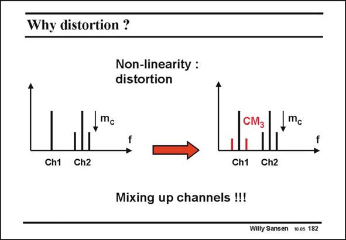

# SANSEN-182 · Why distortion ?

章节：18 基本晶体管电路的失真  
PDF 页：509；书本页：519；幻灯片编号：182  
状态：unreviewed



## 对应教材讲解

### PDF 509 · 书本 519

Distortion is most important in communication systems, in which many frequency channels have to be processed. For example, two channels are shown at two adjacent frequencies. The second of which contains modulation information. Its modulation index is m . c Distortion will cause the modulation to be transferred from Channel 2 to Channel 1. This is called cross-modulation. We want to calculate how the cross-modulation is for a non-linear system.

## 公式／性能结论候选摘录

以下为规则截取的原文，尚未逐项判读。

（未由规则找到；不代表原页没有此类内容。）

## 曲线结论候选摘录

以下为规则截取的原文，尚未逐项判读。

（未由规则找到；不代表原页没有此类内容。）

## 原文条件与近似候选摘录

以下为规则截取的原文，尚未逐项判读。

（未由规则找到；不代表原页没有此类内容。）

## 幻灯片 OCR（未校正）

```text
Why distortion ?
Non-linearity :
distortion
mc
|||
Ch1 Ch2
CM,
1 Ill
Ch1 Ch2
Mixing up channels !!!
Willy Sansen 10.05 182
```

数学上下标、分数及正负号以原图为准。电路图已保留；未核对的连接不输出成可仿真 netlist。
