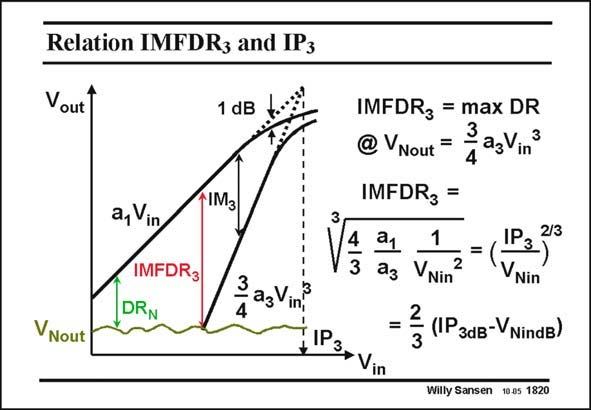

# SANSEN-1820 · Relation IMFDRz and IP3

章节：18 基本晶体管电路的失真  
PDF 页：518；书本页：528；幻灯片编号：1820  
状态：unreviewed



## 对应教材讲解

### PDF 518 · 书本 528

The maximum dynamic range IMFDR is also easily 3 found. It is the IM ratio at 3 the input voltage where the IM component at the 3 output equals the output noise level V . nout Since it also depends on coefficient a , it can be 3 described in terms of the IP . 3 For example, for the same values as on the previous slide, the IMFDR = 3 48.8 dB (when the noise level is at −42 dBm).

## 公式／性能结论候选摘录

以下为规则截取的原文，尚未逐项判读。

- PDF 518: It is the IM ratio at 3 the input voltage where the IM component at the 3 output equals the output noise level V . nout Since it also depends on coefficient a , it can be 3 described in terms of the IP . 3 For example, for the same values as on the previous slide, the IMFDR = 3 48.8 dB (when the noise level is at −42 dBm).

## 曲线结论候选摘录

以下为规则截取的原文，尚未逐项判读。

（未由规则找到；不代表原页没有此类内容。）

## 原文条件与近似候选摘录

以下为规则截取的原文，尚未逐项判读。

（未由规则找到；不代表原页没有此类内容。）

## 幻灯片 OCR（未校正）

```text
Relation IMFDRz and IP3
Vout
1 dB
a, Vin
IMFDR3
DRN
IM3
3
gag Ving
VNout
IMFDR3 = max DR
@VNout =
ЗagVin®
IMFDR3 =
a1
1
3 a3 VNin
2
IP3}
2/3
VNin
= = (IP3d-VNindв)
Willy Sansen 10.05 1820
```

数学上下标、分数及正负号以原图为准。电路图已保留；未核对的连接不输出成可仿真 netlist。
