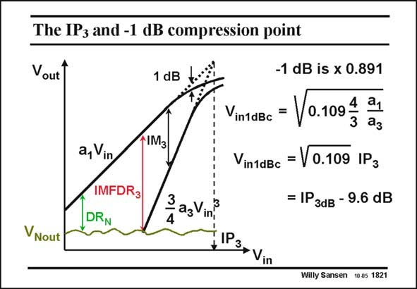

# SANSEN-1821 · The IP3 and -1 dB compression point

章节：18 基本晶体管电路的失真  
PDF 页：519；书本页：529；幻灯片编号：1821  
状态：unreviewed



## 对应教材讲解

### PDF 519 · 书本 529

Another way to specify the IM distortion is the −1 dB 3 compression point V . in1dBc It is the input voltage for which the output amplitude is reduced by 1 dB, as a result of the subtraction of the IM component. This is 3 easy to measure, but is not so accurate, as 1 dB is not that easy to distinguish. It is also given by the a /a ratio as both IM and 1 3 3 the IP . 3 A reduction by 1 dB corresponds to a coefficient of about 0.9. The expressions of the V is therefore easily found. in1dBc Note that the V is always approximately 10 dB smaller than the IP in dB. in1dBc 3

## 公式／性能结论候选摘录

以下为规则截取的原文，尚未逐项判读。

- PDF 519: Another way to specify the IM distortion is the −1 dB 3 compression point V . in1dBc It is the input voltage for which the output amplitude is reduced by 1 dB, as a result of the subtraction of the IM component.
- PDF 519: The expressions of the V is therefore easily found. in1dBc Note that the V is always approximately 10 dB smaller than the IP in dB. in1dBc 3

## 曲线结论候选摘录

以下为规则截取的原文，尚未逐项判读。

（未由规则找到；不代表原页没有此类内容。）

## 原文条件与近似候选摘录

以下为规则截取的原文，尚未逐项判读。

- PDF 519: The expressions of the V is therefore easily found. in1dBc Note that the V is always approximately 10 dB smaller than the IP in dB. in1dBc 3

## 幻灯片 OCR（未校正）

```text
The IP3 and -1 dB compression point
Vout 1
1 dB
NM3
a, Vin
-1 dB is x 0.891
Vin1dBc =
0.109
4
3
a1
a3
VintdBc = V 0.109 IP3
IMFDR3
DRN
ag Ving
= IP3dв - 9.6 dB
VNout
Willy Sansen 10.05 1821
```

数学上下标、分数及正负号以原图为准。电路图已保留；未核对的连接不输出成可仿真 netlist。
