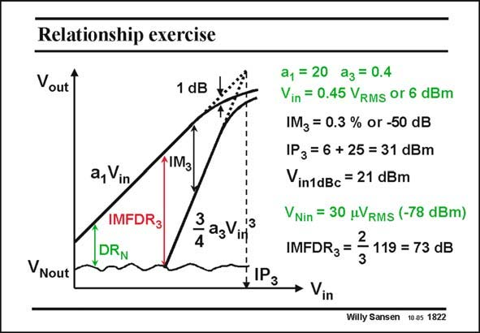

# SANSEN-1822 · Relationship exercise

章节：18 基本晶体管电路的失真  
PDF 页：519；书本页：529；幻灯片编号：1822  
状态：unreviewed



## 对应教材讲解

### PDF 519 · 书本 529

As another exercise, a differential amplifier is taken with a large amount of gain. Its value is 20 or 26 dB. For the third-order coefficient a of 0.4 and 3 input voltage of 0.45 V , RMS all the values are calculated again, which specify the third-order distortion. They are the IM , the IP and 3 3 the V . in1dBc If the input noise level is given (which is the output noise divided by the gain), then the IMFDR can be 3 calculated as well.

## 公式／性能结论候选摘录

以下为规则截取的原文，尚未逐项判读。

- PDF 519: As another exercise, a differential amplifier is taken with a large amount of gain.
- PDF 519: They are the IM , the IP and 3 3 the V . in1dBc If the input noise level is given (which is the output noise divided by the gain), then the IMFDR can be 3 calculated as well.

## 曲线结论候选摘录

以下为规则截取的原文，尚未逐项判读。

（未由规则找到；不代表原页没有此类内容。）

## 原文条件与近似候选摘录

以下为规则截取的原文，尚未逐项判读。

（未由规则找到；不代表原页没有此类内容。）

## 幻灯片 OCR（未校正）

```text
Relationship exercise
Vout
1 dB
a, Vin
IMFDR3
DRN
IM3
3 as Vinf
VNout
*IРз
a1 = 20 az = 0.4
Vin = 0.45 VRMs or 6 dBm
IMz = 0.3 % or -50 dB
IP3 = 6 + 25 = 31 dBm
Vin1dBc = 21 dBm
VNin = 30 uVRMs (-78 dBm)
IMFDR3=
- 119 = 73 dB
• Vin
Willy Sansen 10.05 1822
```

数学上下标、分数及正负号以原图为准。电路图已保留；未核对的连接不输出成可仿真 netlist。
