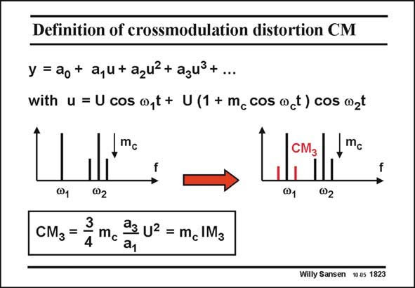

# SANSEN-1823 · Definition of crossmodulation distortion CM

章节：18 基本晶体管电路的失真  
PDF 页：520；书本页：530；幻灯片编号：1823  
状态：unreviewed



## 对应教材讲解

### PDF 520 · 书本 530

Another advantage of dealing with IM is that it also 3 gives the third-order crossmodulation CM . Cross- 3 modulation is what we are really after, as it describes how much modulation information is transferred from one carrier to its adjacent carrier. Application of an amplitude modulated waveform with modulation index m c to the same power series, shows that the CM is 3 simply the product of the IM with the modulation index m . This is also true to some extent for other modulation systems. 3 c There are plenty of reasons to concentrate on the IM as the most important specification of 3 third-order distortion.

## 公式／性能结论候选摘录

以下为规则截取的原文，尚未逐项判读。

（未由规则找到；不代表原页没有此类内容。）

## 曲线结论候选摘录

以下为规则截取的原文，尚未逐项判读。

（未由规则找到；不代表原页没有此类内容。）

## 原文条件与近似候选摘录

以下为规则截取的原文，尚未逐项判读。

（未由规则找到；不代表原页没有此类内容。）

## 幻灯片 OCR（未校正）

```text
Definition of crossmodulation distortion CM
y = ao+ a,u+ azuz+ azu3+...
with u = U cos o,t+ U(1+m_ cos uct) cos wzt
,mc
CM3
.mc
f
@1
@2
3
СM3 =
4
@1
@2
đ3 U2 = mc IM3
a1
Willy Sansen 10.05 1823
```

数学上下标、分数及正负号以原图为准。电路图已保留；未核对的连接不输出成可仿真 netlist。
