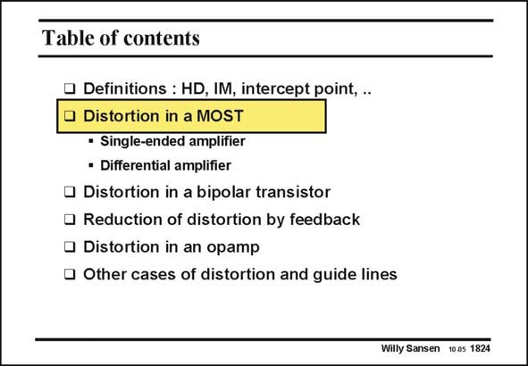

# SANSEN-1824 · Table of contents

章节：18 基本晶体管电路的失真  
PDF 页：520；书本页：530；幻灯片编号：1824  
状态：unreviewed



## 对应教材讲解

### PDF 520 · 书本 530

Let us find out what thirdorder distortion is given by a MOST and then by a bipolar transistor. As a bipolar transistor has the steepest transfer curve, and thus the highest g /I m CE ratio, it will also give the highest distortion. A MOST on the other hand, only has a square-law characteristic. It gives much less distortion. This is why it is used at the input of most receivers, as well as in other exotic technologies such as GaAs.

## 公式／性能结论候选摘录

以下为规则截取的原文，尚未逐项判读。

- PDF 520: As a bipolar transistor has the steepest transfer curve, and thus the highest g /I m CE ratio, it will also give the highest distortion.

## 曲线结论候选摘录

以下为规则截取的原文，尚未逐项判读。

- PDF 520: As a bipolar transistor has the steepest transfer curve, and thus the highest g /I m CE ratio, it will also give the highest distortion.
- PDF 520: A MOST on the other hand, only has a square-law characteristic.

## 原文条件与近似候选摘录

以下为规则截取的原文，尚未逐项判读。

（未由规则找到；不代表原页没有此类内容。）

## 幻灯片 OCR（未校正）

```text
Table of contents
• Definitions : HD, IM, intercept point, ..
• Distortion in a MOST
• Single-ended amplifier
• Differential amplifier
• Distortion in a bipolar transistor
• Reduction of distortion by feedback
• Distortion in an opamp
• Other cases of distortion and guide lines
Willy Sansen 10.05 1824
```

数学上下标、分数及正负号以原图为准。电路图已保留；未核对的连接不输出成可仿真 netlist。
