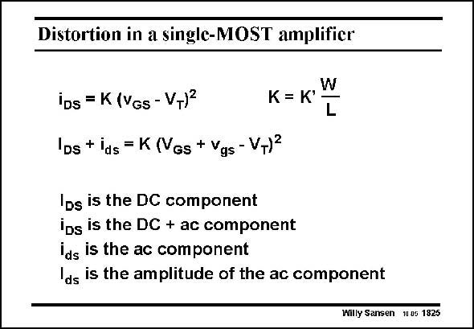

# SANSEN-1825 · Distortion in a single-MOST amplifier

章节：18 基本晶体管电路的失真  
PDF 页：521；书本页：531；幻灯片编号：1825  
状态：unreviewed



## 对应教材讲解

### PDF 521 · 书本 531

The current of a MOST can still be described by a square-law relationship in its simplest form. Application of a smallsignal v , with amplitude gs V , superimposed on a DC gs biasing voltage V , yields GS a small-signal current i ds superimposed on the DC current I . DS Note that we have to write voltages and currents in the correct way so as to clarify which components are actually needed. A graphical explanation is given next.

## 公式／性能结论候选摘录

以下为规则截取的原文，尚未逐项判读。

（未由规则找到；不代表原页没有此类内容。）

## 曲线结论候选摘录

以下为规则截取的原文，尚未逐项判读。

（未由规则找到；不代表原页没有此类内容。）

## 原文条件与近似候选摘录

以下为规则截取的原文，尚未逐项判读。

（未由规则找到；不代表原页没有此类内容。）

## 幻灯片 OCR（未校正）

```text
Distortion in a single-MOST amplifier
iDs = K (Vgs - VT)2
Ips + ids = K (Ves + Vgs - V,)=
W
K= K'
L
IDs is the DC component
ips is the DC + ac component
ids is the ac component
Ids is the amplitude of the ac component
Willy Sansen 10 05 1825
```

数学上下标、分数及正负号以原图为准。电路图已保留；未核对的连接不输出成可仿真 netlist。
