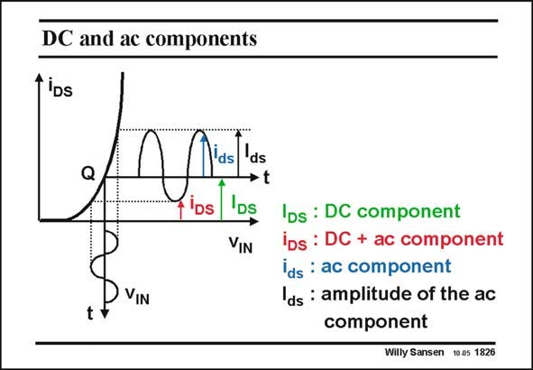

# SANSEN-1826 · DC and ac components

章节：18 基本晶体管电路的失真  
PDF 页：521；书本页：531；幻灯片编号：1826  
状态：unreviewed



## 对应教材讲解

### PDF 521 · 书本 531

DC components are always written with capitals: I is DS therefore the DC current through the transistor. The instantaneous value of the small-signal or AC component is indicated by i , which has an amplitude ds I . ds Finally, the total DC and AC signal is denoted by i . DS This notation is used to give general model and network expressions.

## 公式／性能结论候选摘录

以下为规则截取的原文，尚未逐项判读。

- PDF 521: DC components are always written with capitals: I is DS therefore the DC current through the transistor.

## 曲线结论候选摘录

以下为规则截取的原文，尚未逐项判读。

（未由规则找到；不代表原页没有此类内容。）

## 原文条件与近似候选摘录

以下为规则截取的原文，尚未逐项判读。

（未由规则找到；不代表原页没有此类内容。）

## 幻灯片 OCR（未校正）

```text
DC and ac components
TiDs
IDs : DC component
iDs : DC + ac component
ids : ac component
ds : amplitude of the ac
component
Willy Sansen 10.05 1826
```

数学上下标、分数及正负号以原图为准。电路图已保留；未核对的连接不输出成可仿真 netlist。
