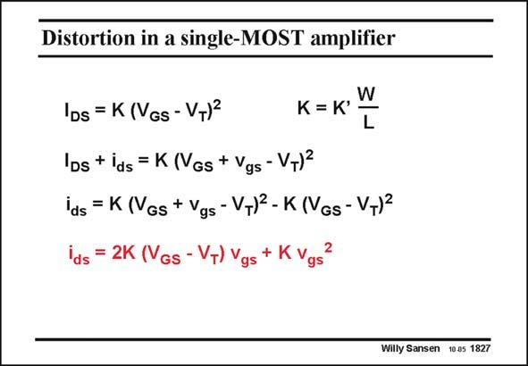

# SANSEN-1827 · Distortion in a single-MOST amplifier

章节：18 基本晶体管电路的失真  
PDF 页：522；书本页：532；幻灯片编号：1827  
状态：unreviewed



## 对应教材讲解

### PDF 522 · 书本 532

Subtraction of the DC component I from the total DS current expression i or DS I +i , gives the AC com- DS ds ponent i . It is easily conds verted in a power series of i versus input voltage v . ds gs It is not surprising to see that no third-order coefficient is present. Indeed, a third-order component cannot be obtained from a square-law relationship! There is no IM , only IM ! 3 2

## 公式／性能结论候选摘录

以下为规则截取的原文，尚未逐项判读。

（未由规则找到；不代表原页没有此类内容。）

## 曲线结论候选摘录

以下为规则截取的原文，尚未逐项判读。

（未由规则找到；不代表原页没有此类内容。）

## 原文条件与近似候选摘录

以下为规则截取的原文，尚未逐项判读。

（未由规则找到；不代表原页没有此类内容。）

## 幻灯片 OCR（未校正）

```text
Distortion in a single-MOST amplifier
W
L
IDs = K (VGs - V+)*
K = K'
Ds + ids = K (Vgs + Vgs - VT)2
ids = K (Vgs + Vgs-VT)2- K (VGs- VT)?
ids = 2K (Vgs - V+) v
+ K
gs
gs
Willy Sansen 10.05 1827
```

数学上下标、分数及正负号以原图为准。电路图已保留；未核对的连接不输出成可仿真 netlist。
