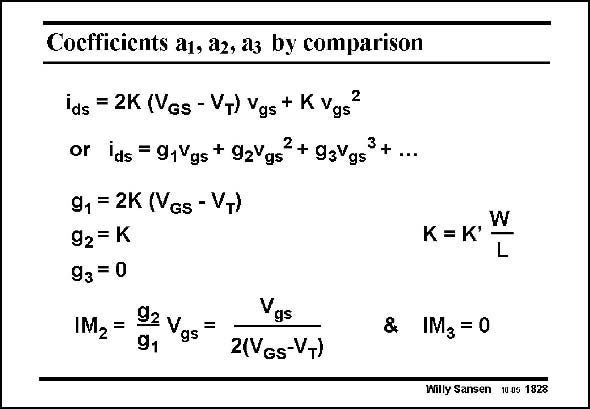

# SANSEN-1828 · Cocfficients a1, az, a3 by comparison

章节：18 基本晶体管电路的失真  
PDF 页：522；书本页：532；幻灯片编号：1828  
状态：unreviewed



## 对应教材讲解

### PDF 522 · 书本 532

The coefficients g of the power series are now easily identified. The first is g , obviously 1 the transconductance g of m the MOST. The second is g , this rep- 2 resents the second-order distortion, described by IM . 2 Its value is proportional to the peak amplitude of the input voltage V , scaled by gs the value of V −V used. GS T For low distortion, large values must be used of V −V . GS T No IM is present, which is an enormous advantage in a single-ended MOST amplifier. Of 3 course, this is only true in so far as the current of a MOST can be accurately described by the simple square-law relationship. This is nowadays only true for values of V −V , slightly GS T over 0.2 V.

## 公式／性能结论候选摘录

以下为规则截取的原文，尚未逐项判读。

- PDF 522: The second is g , this rep- 2 resents the second-order distortion, described by IM . 2 Its value is proportional to the peak amplitude of the input voltage V , scaled by gs the value of V −V used.

## 曲线结论候选摘录

以下为规则截取的原文，尚未逐项判读。

- PDF 522: The second is g , this rep- 2 resents the second-order distortion, described by IM . 2 Its value is proportional to the peak amplitude of the input voltage V , scaled by gs the value of V −V used.

## 原文条件与近似候选摘录

以下为规则截取的原文，尚未逐项判读。

（未由规则找到；不代表原页没有此类内容。）

## 幻灯片 OCR（未校正）

```text
Cocfficients a1, az, a3 by comparison
ids = 2K (Ves - VT) Vgs + KVgs"
or ids =91Vgs + 92Vgs + 93Vgs3+ ...
91 = 2K (VGs - VT)
92= K
93 = 0
IM2=
92 v
gs=
91
Vgs
2(VGs-VT)
W
K = K'
L
& IM3= 0
Willy Sansen 10.05 1828
```

数学上下标、分数及正负号以原图为准。电路图已保留；未核对的连接不输出成可仿真 netlist。
