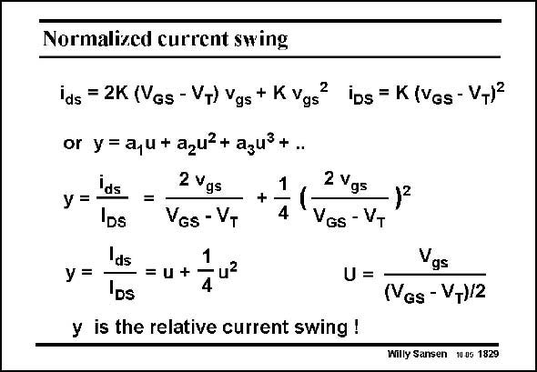

# SANSEN-1829 · Normalized current swing

章节：18 基本晶体管电路的失真  
PDF 页：523；书本页：533；幻灯片编号：1829  
状态：unreviewed



## 对应教材讲解

### PDF 523 · 书本 533

A more general way of describing distortion is to use the relative current swing U rather than the current I or the input voltage ds V . It is defined as the ratio gs of the peak AC current I ds to the DC current I . DS We will see that distortion can easily be calculated once we know what the relative current swing is. Moreover, we will find that any technique which reduces the relative current swing, such as feedback, can be used to reduce distortion. The power series for the relative current swing is denoted by y. Its first-order component is denoted by u, the peak value is denoted by U. Its value is obviously given by the same ratio V gs to V −V . GS T Choosing a large value of V −V will therefore reduce the relative current swing, and hence GS T the IM distortion. 2

## 公式／性能结论候选摘录

以下为规则截取的原文，尚未逐项判读。

- PDF 523: GS T Choosing a large value of V −V will therefore reduce the relative current swing, and hence GS T the IM distortion. 2

## 曲线结论候选摘录

以下为规则截取的原文，尚未逐项判读。

- PDF 523: It is defined as the ratio gs of the peak AC current I ds to the DC current I .
- PDF 523: Its first-order component is denoted by u, the peak value is denoted by U.

## 原文条件与近似候选摘录

以下为规则截取的原文，尚未逐项判读。

（未由规则找到；不代表原页没有此类内容。）

## 幻灯片 OCR（未校正）

```text
Normalized current swing
ids = 2K (Vgs - VT) Ygs + K Vgs
2
or y= a,u+azu?+ azuß+..
Ids
2 Vgs
y =
=
DS
VGs - VT
+
1
4
2 Vgs
VGs - VT
Ids
У =
= u +
u2
4
"DS
U =
y is the relative current swing !
ibs = K (Ves- VT)2
Vgs
(VGs - VT)/2
Willy Sansen 10 05 1829
```

数学上下标、分数及正负号以原图为准。电路图已保留；未核对的连接不输出成可仿真 netlist。
