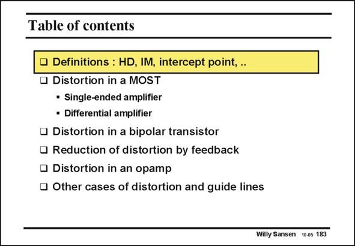

# SANSEN-183 · Table of contents

章节：18 基本晶体管电路的失真  
PDF 页：510；书本页：520；幻灯片编号：183  
状态：unreviewed



## 对应教材讲解

### PDF 510 · 书本 520

Before we engage in calculations, we want to review the definitions commonly used for distortion. After that we will calculate the distortion generated by a MOST, both as a single-ended amplifier as in a differential amplifier. This is repeated for a bipolar transistor. The main technique used to reduce distortion is feedback. Calculations are given to predict the distortion when feedback is present. Finally, some examples are given on how to calculate distortion in more complicated circuits, including operational amplifiers. Both two-stage and three-stage operational amplifiers will be discussed. Finally some other sources of distortion are mentioned but not discussed in detail.

## 公式／性能结论候选摘录

以下为规则截取的原文，尚未逐项判读。

（未由规则找到；不代表原页没有此类内容。）

## 曲线结论候选摘录

以下为规则截取的原文，尚未逐项判读。

（未由规则找到；不代表原页没有此类内容。）

## 原文条件与近似候选摘录

以下为规则截取的原文，尚未逐项判读。

（未由规则找到；不代表原页没有此类内容。）

## 幻灯片 OCR（未校正）

```text
Table of contents
Definitions : HD, IM, intercept point, .
Distortion in a MOST
• Single-ended amplifier
• Differential amplifier
• Distortion in a bipolar transistor
• Reduction of distortion by feedback
• Distortion in an opamp
• Other cases of distortion and guide lines
Willy Sansen 10.05 183
```

数学上下标、分数及正负号以原图为准。电路图已保留；未核对的连接不输出成可仿真 netlist。
