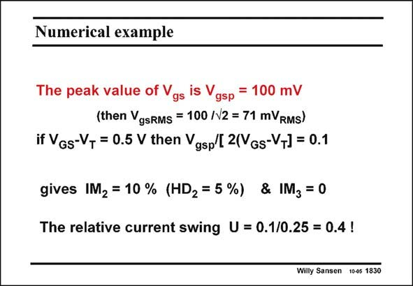

# SANSEN-1830 · Numerical example

章节：18 基本晶体管电路的失真  
PDF 页：523；书本页：533；幻灯片编号：1830  
状态：unreviewed



## 对应教材讲解

### PDF 523 · 书本 533

An example is given in this slide. For a peak relative current swing of 40%, the IM 2 is quite high, i.e. 10%. This is reached for an input voltage of 71 mV if V − RMS GS V =0.5 V. T

## 公式／性能结论候选摘录

以下为规则截取的原文，尚未逐项判读。

（未由规则找到；不代表原页没有此类内容。）

## 曲线结论候选摘录

以下为规则截取的原文，尚未逐项判读。

- PDF 523: For a peak relative current swing of 40%, the IM 2 is quite high, i.e. 10%.

## 原文条件与近似候选摘录

以下为规则截取的原文，尚未逐项判读。

（未由规则找到；不代表原页没有此类内容。）

## 幻灯片 OCR（未校正）

```text
Numerical example
The peak value of Vgs is Vgsp
= 100 mV
(then VgsRMs = 100 /N2 = 71 mVRMs)
if VGs-V, = 0.5 V then Vgsp/[ 2(VGs-VT] = 0.1
gives IM2 = 10 % (HD2 = 5%) & IM3 = 0
The relative current swing U = 0.1/0.25 = 0.4!
Willy Sansen 1005 1830
```

数学上下标、分数及正负号以原图为准。电路图已保留；未核对的连接不输出成可仿真 netlist。
