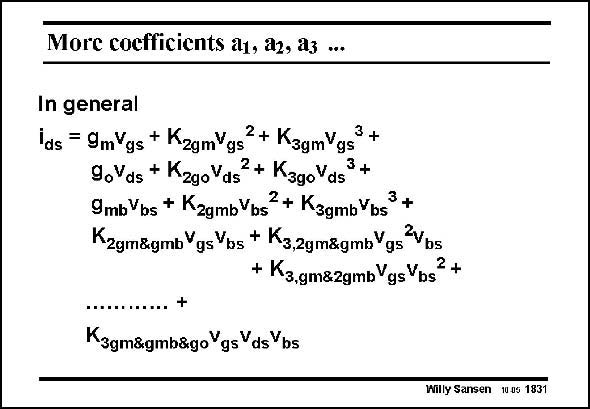

# SANSEN-1831 · More coefficients a1, a2, a3 ...

章节：18 基本晶体管电路的失真  
PDF 页：524；书本页：534；幻灯片编号：1831  
状态：unreviewed



## 对应教材讲解

### PDF 524 · 书本 534

A MOST has many more distortion components. Only K has been dis- 2gm cussed hitherto. In general, K is not zero, leading to 3gm IM . Finding AC voltages 3 at the Drain or at the Bulk, will also generate distortion, and lots of intermodulation products, most of which are of less importance. However, especially as K 2go is K have become more 3g0 important as the output conductance of deep submicron transistor have become quite small. Maybe all distortion components of a MOST have never been fully extracted, certainly not in all three regions of operation such as strong inversion, weak inversion and velocity saturation. We will concentrate mainly on coefficient K which corresponded with K or K∞W/L in the 2gm original (or simplest) power series.

## 公式／性能结论候选摘录

以下为规则截取的原文，尚未逐项判读。

（未由规则找到；不代表原页没有此类内容。）

## 曲线结论候选摘录

以下为规则截取的原文，尚未逐项判读。

（未由规则找到；不代表原页没有此类内容。）

## 原文条件与近似候选摘录

以下为规则截取的原文，尚未逐项判读。

- PDF 524: Maybe all distortion components of a MOST have never been fully extracted, certainly not in all three regions of operation such as strong inversion, weak inversion and velocity saturation.

## 幻灯片 OCR（未校正）

```text
More coefficients a1, a2, a3 ...
In general
las = 9mVgs + KzgmVgs2 + K3gmYgs3 +
9oVds + KzgoVds®
2 + Kago Yds
3+
9mb Vbs + KzgmbVbs
2+ K3gmbYbs
3 +
Kzgm&gmb YgsYbs + K3,2gm&gmbYgs"Vns
+ K3.gm&zgmbYgsVbs
2+
K3gm&gmb&goYgs YdsYbs
Willy Sansen 10 05 1831
```

数学上下标、分数及正负号以原图为准。电路图已保留；未核对的连接不输出成可仿真 netlist。
