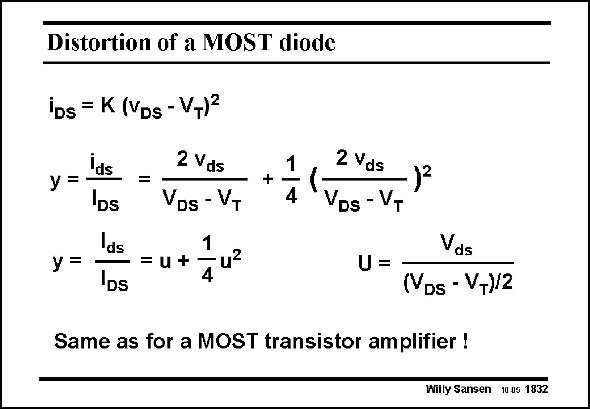

# SANSEN-1832 · Distortion of a MOST diode

章节：18 基本晶体管电路的失真  
PDF 页：524；书本页：534；幻灯片编号：1832  
状态：unreviewed



## 对应教材讲解

### PDF 524 · 书本 534

A MOST with its Drain connected to the Gate is called a diode-connected MOST. It is as non-linear as a MOST. This is clearly seen when v is substituted by GS v in the square-law expres- DS sion of the MOST. The relative current swing and the IM are the same as 2 for the MOST.

## 公式／性能结论候选摘录

以下为规则截取的原文，尚未逐项判读。

（未由规则找到；不代表原页没有此类内容。）

## 曲线结论候选摘录

以下为规则截取的原文，尚未逐项判读。

（未由规则找到；不代表原页没有此类内容。）

## 原文条件与近似候选摘录

以下为规则截取的原文，尚未逐项判读。

（未由规则找到；不代表原页没有此类内容。）

## 幻灯片 OCR（未校正）

```text
Distortion of a MOST diode
iDs = K (VDs - VT)=
Ins
У =
IDs
=
Ids
У =
-= u +
IDs
2 Vds
VDs - VT
1
- u?
4
+
1
4
2 Vds
VDs - VT
U =
Vds
(YDs - V+)/2
Same as for a MOST transistor amplifier !
Willy Sansen 1uus 1832
```

数学上下标、分数及正负号以原图为准。电路图已保留；未核对的连接不输出成可仿真 netlist。
