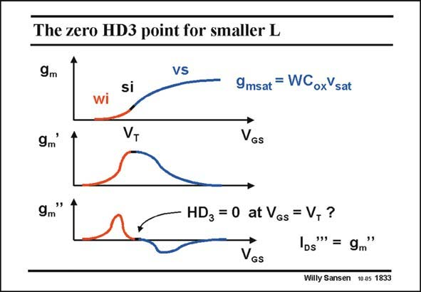

# SANSEN-1833 · The zero HD3 point for smaller L

章节：18 基本晶体管电路的失真  
PDF 页：525；书本页：535；幻灯片编号：1833  
状态：unreviewed



## 对应教材讲解

### PDF 525 · 书本 535

For deep-submicron or manometer CMOS, the strong-inversion has become quite small. It is the region where the curvature is inverted. The exponential of the weak-inversion region curves upwards whereas the flattening in velocity saturation gives a downwards curvature. As a result, the second derivative of the transconductance goes through zero. This is a point of zero HD 3 and IM . It occurs for 3 values just above V . Some T parameter extraction routines take this point as V ! T

## 公式／性能结论候选摘录

以下为规则截取的原文，尚未逐项判读。

- PDF 525: As a result, the second derivative of the transconductance goes through zero.

## 曲线结论候选摘录

以下为规则截取的原文，尚未逐项判读。

- PDF 525: The exponential of the weak-inversion region curves upwards whereas the flattening in velocity saturation gives a downwards curvature.

## 原文条件与近似候选摘录

以下为规则截取的原文，尚未逐项判读。

- PDF 525: The exponential of the weak-inversion region curves upwards whereas the flattening in velocity saturation gives a downwards curvature.

## 幻灯片 OCR（未校正）

```text
The zero HD3 point for smaller L
9m
VS
gm'
si
VT
9msat = WCoxYsat
VGS
9m
"
HD3 = 0 at VGs = V, ?
DS
a'"'= 9m"
VGs
Willy Sansen 10.05 1833
```

数学上下标、分数及正负号以原图为准。电路图已保留；未核对的连接不输出成可仿真 netlist。
