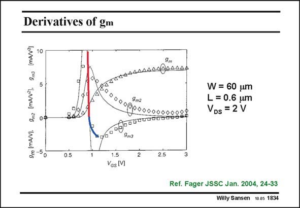

# SANSEN-1834 · Derivatives of gm

章节：18 基本晶体管电路的失真  
PDF 页：525；书本页：535；幻灯片编号：1834  
状态：unreviewed



## 对应教材讲解

### PDF 525 · 书本 535

In practice, however, this point of zero HD is quite 3 sharp. Any variation in V −V or in transistor size GS T gives a large increase in HD . 3 Some experimental curves are shown in this slide. The crossover from weak inversion (red) to velocity saturation (blue) is barely visible. It is exceedingly hard to maintain the biasing (V GS −V ) at this point. T

## 公式／性能结论候选摘录

以下为规则截取的原文，尚未逐项判读。

- PDF 525: Any variation in V −V or in transistor size GS T gives a large increase in HD . 3 Some experimental curves are shown in this slide.

## 曲线结论候选摘录

以下为规则截取的原文，尚未逐项判读。

- PDF 525: Any variation in V −V or in transistor size GS T gives a large increase in HD . 3 Some experimental curves are shown in this slide.

## 原文条件与近似候选摘录

以下为规则截取的原文，尚未逐项判读。

- PDF 525: The crossover from weak inversion (red) to velocity saturation (blue) is barely visible.

## 幻灯片 OCR（未校正）

```text
Derivatives of gm
10
9m (mAV).
-50
9m2 [mAv*),
09
9m3
TATEAAAAAANROAAAA
W= 60 um
L = 0.6 um
VDs = 2 V
1.5
Yos M
2
2.5
Ref. Fager JSSC Jan. 2004, 24-33
Willy Sansen 10.05 1834
```

数学上下标、分数及正负号以原图为准。电路图已保留；未核对的连接不输出成可仿真 netlist。
