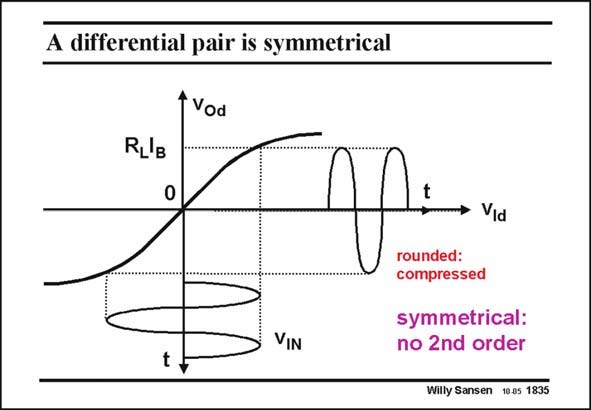

# SANSEN-1835 · A differential pair is symmetrical

章节：18 基本晶体管电路的失真  
PDF 页：526；书本页：536；幻灯片编号：1835  
状态：unreviewed



## 对应教材讲解

### PDF 526 · 书本 536

When two MOSTs are connected as a differential pair, then the limiting transfer characteristic emerges as described in Chapter 3. The input sine wave is therefore rounded or compressed. If no offset is present, then the rounding is the same on both halves of the sine wave. The DC output voltage will not change and the IM 2 is zero. As long as the rounding on both halves is the same, symmetry is maintained and no IM is found. 2 However, third-order distortion is now generated as a result of the rounding.

## 公式／性能结论候选摘录

以下为规则截取的原文，尚未逐项判读。

- PDF 526: When two MOSTs are connected as a differential pair, then the limiting transfer characteristic emerges as described in Chapter 3.
- PDF 526: The input sine wave is therefore rounded or compressed.
- PDF 526: As long as the rounding on both halves is the same, symmetry is maintained and no IM is found. 2 However, third-order distortion is now generated as a result of the rounding.

## 曲线结论候选摘录

以下为规则截取的原文，尚未逐项判读。

- PDF 526: When two MOSTs are connected as a differential pair, then the limiting transfer characteristic emerges as described in Chapter 3.

## 原文条件与近似候选摘录

以下为规则截取的原文，尚未逐项判读。

（未由规则找到；不代表原页没有此类内容。）

## 幻灯片 OCR（未校正）

```text
A differential pair is symmetrical
t Vod
compressed
symmetrical:
no 2nd order
Willy Sansen 10.05 1835
```

数学上下标、分数及正负号以原图为准。电路图已保留；未核对的连接不输出成可仿真 netlist。
