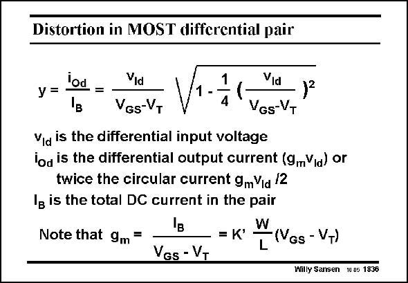

# SANSEN-1836 · Distortion in MOST differential pair

章节：18 基本晶体管电路的失真  
PDF 页：526；书本页：536；幻灯片编号：1836  
状态：unreviewed



## 对应教材讲解

### PDF 526 · 书本 536

The relative current swing in a differential pair with MOSTs is derived in Chapter 3 and repeated here. Care must be taken to have the factors of 2 right! For a small input voltage the output current is linear. The square root with the squared relative input voltage becomes important and causes the flattening of the transfer curve in both directions.

## 公式／性能结论候选摘录

以下为规则截取的原文，尚未逐项判读。

（未由规则找到；不代表原页没有此类内容。）

## 曲线结论候选摘录

以下为规则截取的原文，尚未逐项判读。

- PDF 526: The square root with the squared relative input voltage becomes important and causes the flattening of the transfer curve in both directions.

## 原文条件与近似候选摘录

以下为规则截取的原文，尚未逐项判读。

（未由规则找到；不代表原页没有此类内容。）

## 幻灯片 OCR（未校正）

```text
Distortion in MOST differential pair
Vid
Vid
B
Ves-VT
VGs-VT
Via is the differential input voltage
lod is the differential output current (9mVid) or
twice the circular current gmVia 12
Ig is the total DC current in the pair
Note that 9m =
= K
VGs - VT
L
Gs - VT)
Willy Sansen 10 05 1836
```

数学上下标、分数及正负号以原图为准。电路图已保留；未核对的连接不输出成可仿真 netlist。
