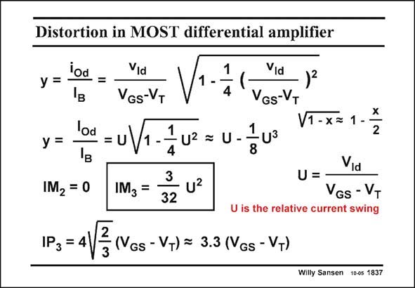

# SANSEN-1837 · Distortion in MOST differential amplifier

章节：18 基本晶体管电路的失真  
PDF 页：527；书本页：537；幻灯片编号：1837  
状态：unreviewed



## 对应教材讲解

### PDF 527 · 书本 537

For a small relative input voltage, the square root can be developed into a power series, only the first term of which is retained. The power series of the relative current swing y has become very simple. Coefficient a =1 and a = 1 3 1/8. Obviously, IM is zero 2 and the IM is simply about 3 one tenth of the peak relative current swing U squared. Again, for a large value of V −V , the relative cur- GS T rent swing is small and so is the IM . 3 This is also obvious from the IP , which is proportional to V −V .For a V −V of 0.5 V, 3 GS T GS T we obtain an IP of 1.65 V or 17.4 dBm. 3

## 公式／性能结论候选摘录

以下为规则截取的原文，尚未逐项判读。

- PDF 527: Again, for a large value of V −V , the relative cur- GS T rent swing is small and so is the IM . 3 This is also obvious from the IP , which is proportional to V −V .For a V −V of 0.5 V, 3 GS T GS T we obtain an IP of 1.65 V or 17.4 dBm. 3

## 曲线结论候选摘录

以下为规则截取的原文，尚未逐项判读。

- PDF 527: Obviously, IM is zero 2 and the IM is simply about 3 one tenth of the peak relative current swing U squared.

## 原文条件与近似候选摘录

以下为规则截取的原文，尚未逐项判读。

（未由规则找到；不代表原页没有此类内容。）

## 幻灯片 OCR（未校正）

```text
Distortion in MOST differential amplifier
iod
У =
Vid
VGS-VT
1
4
Vid
VGS-VT
)2
y =
lod = u
X
V1 -x=
1 --
2
U2
=U-
8
IM2 = 0
IM3 =
3
u2
32
Via
U=-
VGs - VT
U is the relative current swing
2
IP3 = 4/
3
(VGs - VT) = 3.3 (VGs - VT)
Willy Sansen 10-0s 1837
```

数学上下标、分数及正负号以原图为准。电路图已保留；未核对的连接不输出成可仿真 netlist。
