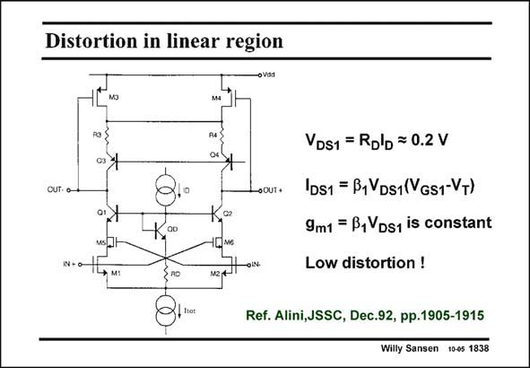

# SANSEN-1838 · Distortion in linear region

章节：18 基本晶体管电路的失真  
PDF 页：527；书本页：537；幻灯片编号：1838  
状态：unreviewed



## 对应教材讲解

### PDF 527 · 书本 537

The third-order distortion in a differential pair can be reduced by biasing the MOSTs in the linear region. For this purpose, the values of V of the input DS MOSTs must be kept constant at a value between 100 and 200 mV. This is achieved by means of a constant-current source I . If D V =V =V then the GS1 GS2 GSD input transistors M1 and M2 have equal V . The DS resulting values of g and m1 g are less in absolute value m2 than in the saturation region, but more constant. Moreover, changing the value of the current source I allows a change in the input transcon- D ductance for use in a g −C filter (see next Chapter). m The transistors M5 and M6 are shorted. They are used to compensate the poles associated with the input capacitances C and C . GS1 GS2

## 公式／性能结论候选摘录

以下为规则截取的原文，尚未逐项判读。

- PDF 527: If D V =V =V then the GS1 GS2 GSD input transistors M1 and M2 have equal V .

## 曲线结论候选摘录

以下为规则截取的原文，尚未逐项判读。

（未由规则找到；不代表原页没有此类内容。）

## 原文条件与近似候选摘录

以下为规则截取的原文，尚未逐项判读。

- PDF 527: The DS resulting values of g and m1 g are less in absolute value m2 than in the saturation region, but more constant.

## 幻灯片 OCR（未校正）

```text
Distortion in linear region
мз
OUT- O
•OUT+
0o
IN + 0-
* м:
VDs1 = Rolb = 0.2 V
IDs1 = B1VDs1(VGs1-VT)
9m1 = B,VDs1 is constant
Low distortion !
Ref. Alini,JSSC, Dec.92, pp.1905-1915
Willy Sansen 10-05 1838
```

数学上下标、分数及正负号以原图为准。电路图已保留；未核对的连接不输出成可仿真 netlist。
