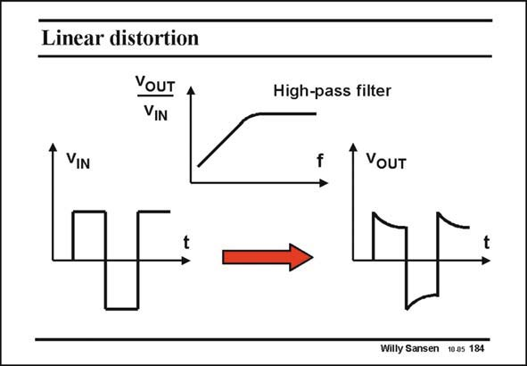

# SANSEN-184 · Linear distortion

章节：18 基本晶体管电路的失真  
PDF 页：510；书本页：520；幻灯片编号：184  
状态：unreviewed



## 对应教材讲解

### PDF 510 · 书本 520

We will not discuss the effects of linear distortion in this Chapter but of nonlinear distortion. Linear distortion is a result of filter action. A perfectly linear system which shows some kind of filtering action, will distort the picture of the signal versus time. For example, a highpass filter will emphasize the steep edges of a square waveform, as they represent the higher frequencies. The output waveform has therefore peaked. It is different from the input waveform, and is distorted. This is linear distortion. It occurs for all filters.

## 公式／性能结论候选摘录

以下为规则截取的原文，尚未逐项判读。

- PDF 510: The output waveform has therefore peaked.

## 曲线结论候选摘录

以下为规则截取的原文，尚未逐项判读。

- PDF 510: The output waveform has therefore peaked.

## 原文条件与近似候选摘录

以下为规则截取的原文，尚未逐项判读。

（未由规则找到；不代表原页没有此类内容。）

## 幻灯片 OCR（未校正）

```text
Linear distortion
YOUT
VIN
High-pass filter
VIN
VoUT
Willy Sansen 10.05 184
```

数学上下标、分数及正负号以原图为准。电路图已保留；未核对的连接不输出成可仿真 netlist。
