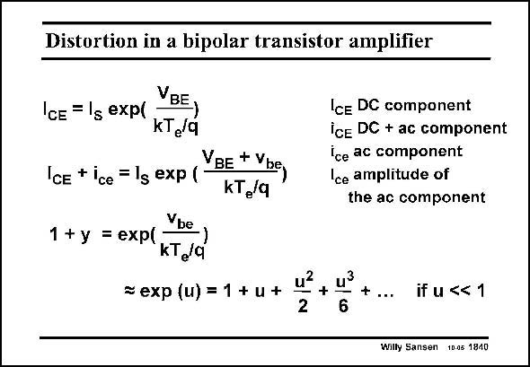

# SANSEN-1840 · Distortion in a bipolar transistor amplifier

章节：18 基本晶体管电路的失真  
PDF 页：528；书本页：538；幻灯片编号：1840  
状态：unreviewed



## 对应教材讲解

### PDF 528 · 书本 538

A bipolar transistor is exponential. Application of a DC Base-Emitter voltage V BE with an ac voltage v superbe imposed, gives a DC collector current I with a AC CE signal i on it. The relative ce collector current swing is denoted by y. It is obtained by a simple division of both currents. This exponential can now be developed into a power series, provided the input signal amplitude V is small be compared to kT /q. e

## 公式／性能结论候选摘录

以下为规则截取的原文，尚未逐项判读。

（未由规则找到；不代表原页没有此类内容。）

## 曲线结论候选摘录

以下为规则截取的原文，尚未逐项判读。

（未由规则找到；不代表原页没有此类内容。）

## 原文条件与近似候选摘录

以下为规则截取的原文，尚未逐项判读。

- PDF 528: This exponential can now be developed into a power series, provided the input signal amplitude V is small be compared to kT /q. e

## 幻灯片 OCR（未校正）

```text
Distortion in a bipolar transistor amplifier
CE = lg exp(
VBE,
KT,/q
IcE + ice = lg exp (
VBE + Ybe,
kT,/q
1 + y = exp(
Vbe,
kT,/q
= exp (u) = 1 + u +
Ice DC component
Ice DC + ac component
ice ac component
Ice amplitude of
the ac component
+
+...
2
6
if u << 1
Wilty Sansen 10.05 1840
```

数学上下标、分数及正负号以原图为准。电路图已保留；未核对的连接不输出成可仿真 netlist。
