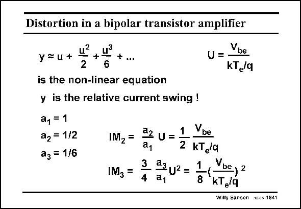

# SANSEN-1841 · Distortion in a bipolar transistor amplifier

章节：18 基本晶体管电路的失真  
PDF 页：529；书本页：539；幻灯片编号：1841  
状态：unreviewed



## 对应教材讲解

### PDF 529 · 书本 539

The coefficients of the power series are now given in this slide. The distortion components IM and IM are 2 3 easily derived from them. It is clear that a bipolar transistor gives both even and odd-order distortion. Also, their values are quite large.

## 公式／性能结论候选摘录

以下为规则截取的原文，尚未逐项判读。

（未由规则找到；不代表原页没有此类内容。）

## 曲线结论候选摘录

以下为规则截取的原文，尚未逐项判读。

（未由规则找到；不代表原页没有此类内容。）

## 原文条件与近似候选摘录

以下为规则截取的原文，尚未逐项判读。

（未由规则找到；不代表原页没有此类内容。）

## 幻灯片 OCR（未校正）

```text
Distortion in a bipolar transistor amplifier
y =u+
+...
2
is the non-linear equation
y is the relative current swing !
a1 =1
a2 = 1/2
a3 = 1/6
u= Vbe
KT/q
IM2=
a2 U =
1
Vbe
a1
2 KTg9
3
IM3 =
23 U2 =
1
Vbe, 2
4
a1
8
kT,/q
Wilty Sansen 10.05 1841
```

数学上下标、分数及正负号以原图为准。电路图已保留；未核对的连接不输出成可仿真 netlist。
