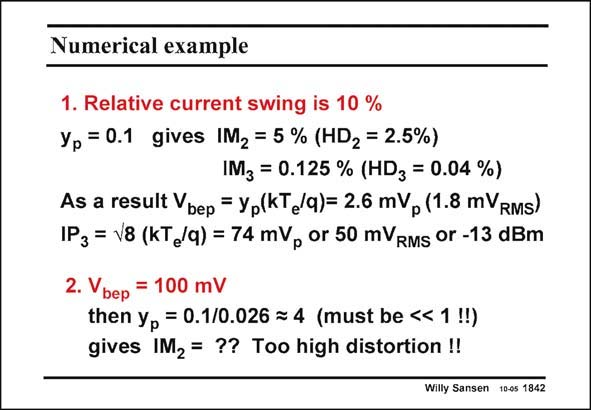

# SANSEN-1842 · Numerical example

章节：18 基本晶体管电路的失真  
PDF 页：529；书本页：539；幻灯片编号：1842  
状态：unreviewed



## 对应教材讲解

### PDF 529 · 书本 539

For example, if a relative current swing is used with a maximum of 10%, then the IM is 0.125%. Only 3 1.8 mV input signal will RMS now be needed. The IP is quite small. 3 It is only 50 mV or RMS −13 dBm. For an input voltage of 100 mV peak. The bipolar transistor is overdriven. Power series cannot be used any more, but Bessel functions. We do not develop this topic any more.

## 公式／性能结论候选摘录

以下为规则截取的原文，尚未逐项判读。

（未由规则找到；不代表原页没有此类内容。）

## 曲线结论候选摘录

以下为规则截取的原文，尚未逐项判读。

- PDF 529: For an input voltage of 100 mV peak.

## 原文条件与近似候选摘录

以下为规则截取的原文，尚未逐项判读。

（未由规则找到；不代表原页没有此类内容。）

## 幻灯片 OCR（未校正）

```text
Numerical example
1. Relative current swing is 10 %
Yp =0.1 gives IM2 = 5 % (HD2 = 2.5%)
IMz = 0.125 % (HDz = 0.04 %)
As a result Vbep = Yp(KT /q)= 2.6 mVp (1.8 mVRMs)
1P3 = 18 (kT /q) = 74 mVp or 50 mVRMs Or -13 dBm
2. Vbep = 100 mV
then yp = 0.1/0.026 = 4 (must be << 1 !!)
gives IM2 = ?? Too high distortion !!
Willy Sansen 10-os 1842
```

数学上下标、分数及正负号以原图为准。电路图已保留；未核对的连接不输出成可仿真 netlist。
