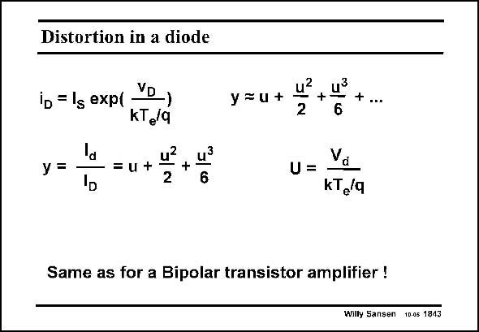

# SANSEN-1843 · Distortion in a diode

章节：18 基本晶体管电路的失真  
PDF 页：530；书本页：540；幻灯片编号：1843  
状态：unreviewed



## 对应教材讲解

### PDF 530 · 书本 540

If a bipolar transistor is connected as a diode, which is actually the Base-Emitter diode, then the same amount of distortion can be expected. This diode has been used, for example, at the input of a bipolar current mirror. The distortion at the middle point of a current mirror is therefore quite large.

## 公式／性能结论候选摘录

以下为规则截取的原文，尚未逐项判读。

- PDF 530: The distortion at the middle point of a current mirror is therefore quite large.

## 曲线结论候选摘录

以下为规则截取的原文，尚未逐项判读。

（未由规则找到；不代表原页没有此类内容。）

## 原文条件与近似候选摘录

以下为规则截取的原文，尚未逐项判读。

（未由规则找到；不代表原页没有此类内容。）

## 幻灯片 OCR（未校正）

```text
Distortion in a diode
ib = lg exp( YD)
KTeq
У =
-= u+
+ lể
2
y=u+
2
+ u3
+ ...
6
U =
Va
KT/9
Same as for a Bipolar transistor amplifier !
Wilty Sansen 10.05 1843
```

数学上下标、分数及正负号以原图为准。电路图已保留；未核对的连接不输出成可仿真 netlist。
