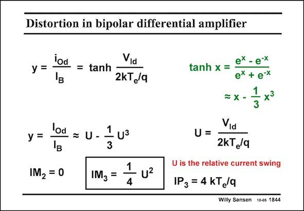

# SANSEN-1844 · Distortion in bipolar differential amplifier

章节：18 基本晶体管电路的失真  
PDF 页：530；书本页：540；幻灯片编号：1844  
状态：unreviewed



## 对应教材讲解

### PDF 530 · 书本 540

When two bipolar transistors are connected as a differential pair, the transfer characteristic now consists of exponentials as well. Together they yield a tanh function, as explained in Chapter 3. If the applied differential input voltage v is small Id compared to kT /q, then e these functions can be developed into power series. Again, the second-order component is zero if there is no mismatch. The thirdorder component gives rise to the IM shown in this slide. The corresponding IP is also given. 3 3 Remember that a MOST differential pair had about 1/10 of U2 as IM , now it is 1/4 U2. A 3 MOST differential pair is 2.5 times better for IM than a bipolar differential pair, for the same 3 relative current swing. Moreover, the input voltage corresponding with it is also larger, as in a MOST differential pair the input voltage is scaled to V −V . GS T

## 公式／性能结论候选摘录

以下为规则截取的原文，尚未逐项判读。

（未由规则找到；不代表原页没有此类内容。）

## 曲线结论候选摘录

以下为规则截取的原文，尚未逐项判读。

- PDF 530: When two bipolar transistors are connected as a differential pair, the transfer characteristic now consists of exponentials as well.

## 原文条件与近似候选摘录

以下为规则截取的原文，尚未逐项判读。

（未由规则找到；不代表原页没有此类内容。）

## 幻灯片 OCR（未校正）

```text
Distortion in bipolar differential amplifier
y =
iod = tanh
Vid
2kT /q
y =
IM2 = 0
lod = U-
1
- U3
3
1
IM3 =
4
ex - e-x
tanh x =:
ex + e-x
1
=X -
x?
3
Via
U=
2kTg/q
U is the relative current swing
IP 3 = 4 KTe/q
Willy Sansen 10-0s 1844
```

数学上下标、分数及正负号以原图为准。电路图已保留；未核对的连接不输出成可仿真 netlist。
