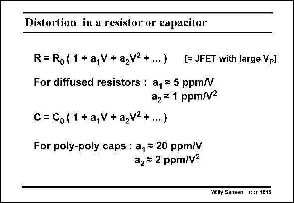

# SANSEN-1845 · Distortion in a resistor or capacitor

章节：18 基本晶体管电路的失真  
PDF 页：531；书本页：541；幻灯片编号：1845  
状态：unreviewed



## 对应教材讲解

### PDF 531 · 书本 541

Before we end this section on distortion of bipolar transistors, this is probably a good place to comment about distortion in resistors and capacitors. Diffused resistors are fairly nonlinear as they are separated from the substrate by a depletion layer. The voltage across the resistor modifies the thickness of the depletion layer and the conductivity of the resistor. A resistor behaves as a Junction FET with a high pinch-off (or threshold) voltage. Its effective V −V is very high and its distortion is relatively GS T low. It is not negligible, however. Poly resistors and metal resistors do not have this depletion layer and are much more linear. The same applies to capacitances. Diffusion capacitances are depletion layer capacitances and are very nonlinear. Metal-to-metal capacitances, on the other hand, are very linear. This also applies to polyto-poly capacitances, some values are given in this slide.

## 公式／性能结论候选摘录

以下为规则截取的原文，尚未逐项判读。

（未由规则找到；不代表原页没有此类内容。）

## 曲线结论候选摘录

以下为规则截取的原文，尚未逐项判读。

（未由规则找到；不代表原页没有此类内容。）

## 原文条件与近似候选摘录

以下为规则截取的原文，尚未逐项判读。

（未由规则找到；不代表原页没有此类内容。）

## 幻灯片 OCR（未校正）

```text
Distortion in a resistor or capacitor
R= Ro (1 +a,V+a2V2+...) EJFET with large Vp]
For diffused resistors : a, = 5 ppm/V
a, = 1 ppm/V2
C= Co (1 +a,V+a,V2+...)
For poly-poly caps : a, = 20 ppm/V
a, = 2 ppm/V=
Wilty Sansen 10.05 1845
```

数学上下标、分数及正负号以原图为准。电路图已保留；未核对的连接不输出成可仿真 netlist。
