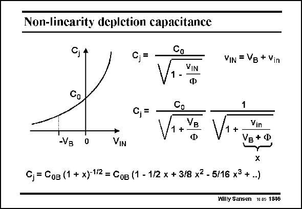

# SANSEN-1846 · Non-lincarity depletion capacitance

章节：18 基本晶体管电路的失真  
PDF 页：531；书本页：541；幻灯片编号：1846  
状态：unreviewed



## 对应教材讲解

### PDF 531 · 书本 541

The non-linear characteristic of a diffusion capacitance is illustrated in this slide. The junction capacitance C is C at zero Volt across j 0 it. It is modeled by a squareroot characteristic. For a bias Voltage -V , the junc- B tion capacitance can be described by a DC factor followed by an AC one. This latter factor can now be developed into a power series. Its coefficients can be used to calculate the values of IM and IM . 2 3

## 公式／性能结论候选摘录

以下为规则截取的原文，尚未逐项判读。

（未由规则找到；不代表原页没有此类内容。）

## 曲线结论候选摘录

以下为规则截取的原文，尚未逐项判读。

- PDF 531: The non-linear characteristic of a diffusion capacitance is illustrated in this slide.
- PDF 531: It is modeled by a squareroot characteristic.

## 原文条件与近似候选摘录

以下为规则截取的原文，尚未逐项判读。

（未由规则找到；不代表原页没有此类内容。）

## 幻灯片 OCR（未校正）

```text
Non-lincarity depletion capacitance
Co
VIN = VB + Vin
VIN
Ф
Co
-
0,=
+VB
-VB
0
VIN
V1+
Vin
Vв+Ф
Сj = Сов (1 + x)-1/2 = Сов (1 - 1/2 х + 3/8 x2 - 5/16 х3 + ..)
Willy Sansen 10.05 1846
```

数学上下标、分数及正负号以原图为准。电路图已保留；未核对的连接不输出成可仿真 netlist。
