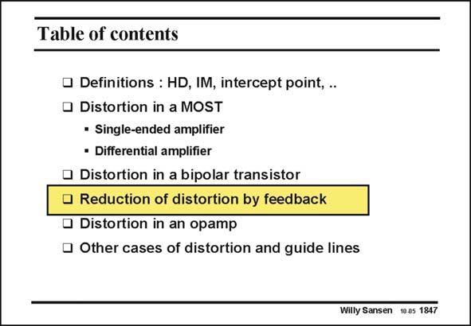

# SANSEN-1847 · Table of contents

章节：18 基本晶体管电路的失真  
PDF 页：532；书本页：542；幻灯片编号：1847  
状态：unreviewed



## 对应教材讲解

### PDF 532 · 书本 542

The most common technique to reduce the distortion is by application of feedback. Feedback reduces distortion in two ways. First of all, it reduces the relative current swing. Secondly, it reduces the distortion by the feedback factor (or loop gain). Let us investigate how the coefficients of the power series are affected by the feedback. We will now calculate the actual distortion components IM and IM . Index f is used to indicate that they are valid for a system with 2f 3f feedback.

## 公式／性能结论候选摘录

以下为规则截取的原文，尚未逐项判读。

- PDF 532: Secondly, it reduces the distortion by the feedback factor (or loop gain).

## 曲线结论候选摘录

以下为规则截取的原文，尚未逐项判读。

（未由规则找到；不代表原页没有此类内容。）

## 原文条件与近似候选摘录

以下为规则截取的原文，尚未逐项判读。

（未由规则找到；不代表原页没有此类内容。）

## 幻灯片 OCR（未校正）

```text
Table of contents
• Definitions : HD, IM, intercept point, ..
• Distortion in a MOST
• Single-ended amplifier
• Differential amplifier
• Distortion in a bipolar transistor
• Reduction of distortion by feedback
• Distortion in an opamp
• Other cases of distortion and guide lines
Willy Sansen 10.05 1847
```

数学上下标、分数及正负号以原图为准。电路图已保留；未核对的连接不输出成可仿真 netlist。
