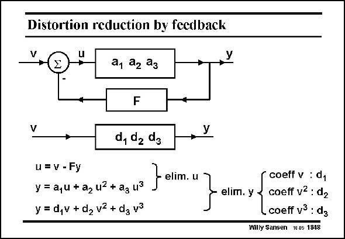

# SANSEN-1848 · Distortion reduction by feedback

章节：18 基本晶体管电路的失真  
PDF 页：532；书本页：542；幻灯片编号：1848  
状态：unreviewed



## 对应教材讲解

### PDF 532 · 书本 542

Feedback with factor F is applied around a non-linear amplifier, characterized by coefficients a , a , a , .... The 1 2 3 same system can also be described by coefficients d , 1 d , d , ... The question is, 2 3 what is the relationship between the coefficients d and a? This is found by writing the network equation and elimination of u. Subsequent elimination of y between this result and the power series with coefficients d yields these d coefficients. They are given next.

## 公式／性能结论候选摘录

以下为规则截取的原文，尚未逐项判读。

（未由规则找到；不代表原页没有此类内容。）

## 曲线结论候选摘录

以下为规则截取的原文，尚未逐项判读。

（未由规则找到；不代表原页没有此类内容。）

## 原文条件与近似候选摘录

以下为规则截取的原文，尚未逐项判读。

（未由规则找到；不代表原页没有此类内容。）

## 幻灯片 OCR（未校正）

```text
Distortion reduction by feedback
+
V
a1 22 23
F
d, da da
+
У
u=v - Fy
y = a,u + a2 u2 + ag u3
y = d,v + d2 v2 + dg va
elim. u
elim. y
coeff v : d1
coeff v2: d2
coeff v3 : dg
Willy Sansen 10.05 1848
```

数学上下标、分数及正负号以原图为准。电路图已保留；未核对的连接不输出成可仿真 netlist。
